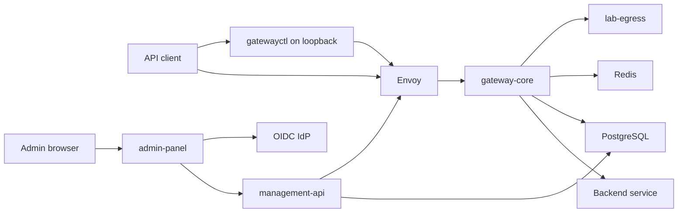

# Project Map

> [!summary] At a glance
> Choose a domain first, then move to the smallest authoritative architecture, guide, reference, or runbook note.

## By Domain

| Domain | Use it for |
| --- | --- |
| [[Data Plane]] | Runtime requests, routing, policies, and forwarding |
| [[Control Plane]] | Management API, configuration, revisions, deployments, and hot reload |
| [[Security and Identity]] | Client authentication, authorization, OAuth, mTLS, PKI, and OIDC |
| [[Operations]] | Local startup, configuration, health, synchronization, and recovery |
| [[Development]] | Package ownership, persistence, implementation, tests, and documentation |
| [[Decision Records]] | Architectural rationale and accepted tradeoffs |

## By Development Task

| Task | Domain map | First authoritative note |
| --- | --- | --- |
| Understand the platform | [[Development]] | [[Global Architecture]] |
| Trace a gateway request | [[Data Plane]] | [[Runtime Request Flow]] |
| Change persistence | [[Development]] | [[Data Model]] |
| Import or deploy a proxy | [[Control Plane]] | [[How to Add a New Proxy]] |
| Trace runtime synchronization | [[Control Plane]] | [[Hot Reload Sync]] |
| Work on policies | [[Data Plane]] | [[Policy Reference Index]] |
| Configure client authentication | [[Security and Identity]] | [[Authentication and Authorization]] |
| Work on certificates or trust | [[Security and Identity]] | [[Multi-Client PKI]] |
| Work on the control plane | [[Control Plane]] | [[Management API]] |
| Call the control plane manually | [[Control Plane]] | [[How to Use the Management API with Postman]] |
| Learn in an isolated workspace | [[Control Plane]] | [[How to Learn the Gateway with the Lab]] |
| Connect client-owned JWT or mTLS keys | [[Security and Identity]] | [[How to Connect Local Keys to the Playground]] |
| Run the project | [[Operations]] | [[How to Start the Project]] |
| Stop, resume, or reset local state | [[Operations]] | [[How to Manage the Local Platform Lifecycle]] |
| Find the right command | [[Operations]] | [[Command Reference]] |
| Diagnose a failure | [[Operations]] | [[Debug Gateway 404]] |

## Runtime Ownership

Solid arrows represent current runtime interactions.

## Documentation Boundaries

- Concepts explain reusable domain ideas.
- Architecture explains system-wide design and interactions.
- Package notes explain code ownership and package contracts.
- Guides describe tasks.
- Reference pages state exact current values.
- ADRs explain why a durable decision was made.
- Runbooks begin from an operational symptom.

## Current Gaps

Membership administration, environment catalog writes, public production
deployment controls, production key management, and Prometheus metrics are not implemented.
The Admin Panel does not yet expose the complete Management API. See
[[Current Status]] for the verified feature matrix.
