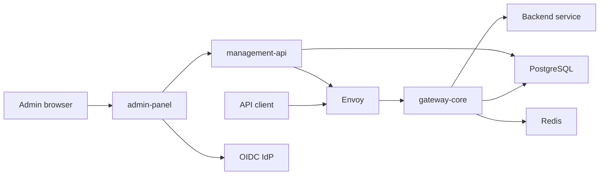

# Project Map

> [!summary] At a glance
> Use this map to move from a development question to the smallest authoritative set of project notes.

## By Development Task

| Task | Start with | Continue with |
| --- | --- | --- |
| Understand the platform | [[Global Architecture]] | [[Data Plane vs Control Plane]] |
| Trace a gateway request | [[Runtime Request Flow]] | [[Routing Engine]], [[gateway-core]] |
| Change persistence | [[Data Model]] | [[Database Schema]], [[database]] |
| Import or deploy a proxy | [[How to Add a New Proxy]] | [[How to Import and Deploy a Proxy Revision]], [[Proxy Revisions and Deployments]] |
| Work on policies | [[Policy Types]] | [[Policy Reference Index]], [[Debug Policy Failure]] |
| Configure client authentication | [[Authentication and Authorization]] | [[How to Configure Application Authentication]], [[Debug OAuth and mTLS]] |
| Work on certificates or trust | [[Multi-Client PKI]] | [[pki]], [[ADR-006 Envoy and Managed Client PKI]] |
| Work on the control plane | [[Control Plane Flow]] | [[Management API]], [[management-api]] |
| Run the project | [[How to Start the Project]] | [[Ports]], [[Environment Variables]] |
| Diagnose a failure | [[Debug Gateway 404]] | [[Debug Policy Failure]], [[Reset Local Database]] |

## Runtime Ownership

Solid arrows represent current runtime interactions.

## Documentation Boundaries

- Concepts explain reusable domain ideas.
- Architecture explains system-wide design and interactions.
- Package notes explain code ownership and package contracts.
- Guides describe tasks.
- Reference pages state exact current values.
- ADRs explain why a durable decision was made.
- Runbooks begin from an operational symptom.

## Current Gaps

Product management, proxy configuration hot reload, production key management,
and Prometheus metrics are not implemented. The Admin Panel does not yet expose
the proxy revision API. See [[Current Status]] for the verified feature matrix.
