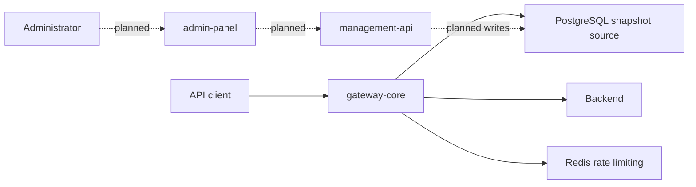

# Data Plane vs Control Plane

> [!summary] At a glance
> The data plane handles live API traffic, while the partially built control plane is intended to manage configuration.

## Definition

The data plane is the latency-sensitive path followed by API requests. The
control plane is the administrative path used to create, validate, and deploy
the configuration consumed by the data plane.

## Why It Matters

Separating the planes allows request processing to remain independent from the
availability and scaling profile of administration tools.

| Plane | Package | Current responsibility | Maturity |
| --- | --- | --- | --- |
| Data | `gateway-core` | Load configuration, route, execute policies, forward | Implemented |
| Control API | `management-api` | Health endpoint; CRUD is intended | Partial |
| Control UI | `admin-panel` | Placeholder Next.js pages | Partial |

## Project Mapping

The gateway does not query PostgreSQL per request. It loads a complete snapshot
at startup and after committed routing versions; Redis notification accelerates
reload while PostgreSQL reconciliation guarantees convergence.

## Related Notes

- [[Global Architecture]]
- [[Control Plane Flow]]
- [[Hot Reload Sync]]
- [[gateway-core]]
