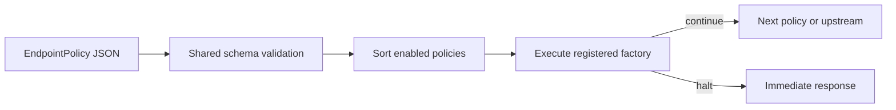

# Policies in Apigee

> [!summary] At a glance
> Apigee offers policies across request and response flows; this project currently implements a smaller ordered request pipeline with two executable policy types.

## Definition

An Apigee policy is a configured unit of cross-cutting API behavior, such as
authentication, traffic control, transformation, logging, or fault generation.
Policies are attached to flow stages and execute in a defined order.

## Why It Matters

Policy-based behavior keeps routing separate from reusable security and traffic
rules. It also makes configuration validation and failure behavior explicit.

## Apigee Categories

| Category | Examples |
| --- | --- |
| Security | OAuth, API key verification, JWT, Basic authentication, CORS |
| Traffic management | Spike arrest, quota, concurrent rate limits |
| Mediation | Assign message, extract variables, JSON/XML conversion, XSLT |
| Extension | JavaScript, service callouts, faults, message logging |

See [[Policy Reference Index]] for individual research notes.

## Project Mapping

This project stores policy configuration as JSON in PostgreSQL and validates it
against shared Zod schemas during gateway startup. Enabled endpoint policies are
sorted by `order` and executed until one returns `halt`.

Current runtime factories:

- `api-key-auth`
- `rate-limit`

Shared contracts also name planned policies. A contract name is not executable
until a factory is registered in `gateway-core`.

XML compatibility is an accepted target in [[ADR-004 XML Policies]], but no
XML editor or converter is implemented.

## Related Notes

- [[Request Lifecycle in Apigee]]
- [[Policy Types]]
- [[Debug Policy Failure]]
