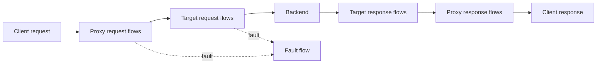
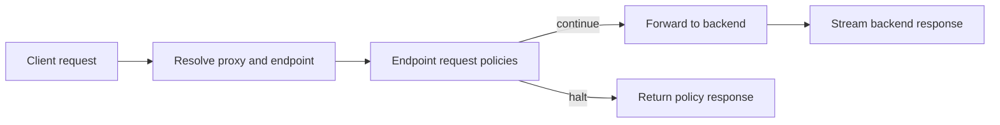

# Request Lifecycle in Apigee

> [!summary] At a glance
> Apigee supports staged request, target, response, and fault flows; this project currently executes one endpoint-level request policy chain before forwarding.

## Definition

Apigee processes traffic through proxy request flows, a target request, target
response flows, proxy response flows, and fault handling. Policies can run in
preflows, conditional flows, and postflows on both sides of the upstream call.

## Why It Matters

The stage determines which information a policy can inspect or change and
whether it runs before or after the backend.

## Apigee Lifecycle

## Project Mapping

Implemented:

- Longest-prefix proxy matching.
- Explicit static and dynamic endpoint matching.
- Ordered endpoint request policies.
- Policy halt responses and open/closed infrastructure failure modes.
- Byte-preserving request forwarding and response relay.

Not implemented:

- Separate preflow, conditional flow, and postflow stages.
- Target-side or response-side policy pipelines.
- General fault rules independent from policy responses.
- XML policy input and conversion.

## Related Notes

- [[Policies in Apigee]]
- [[Runtime Request Flow]]
- [[Routing Engine]]
- [[gateway-core]]
