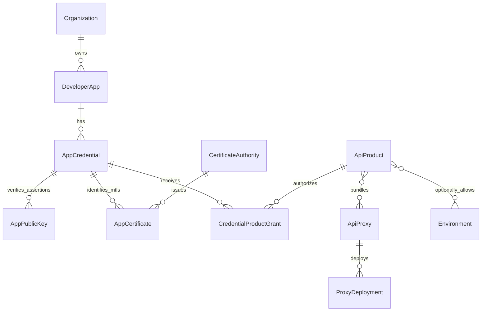
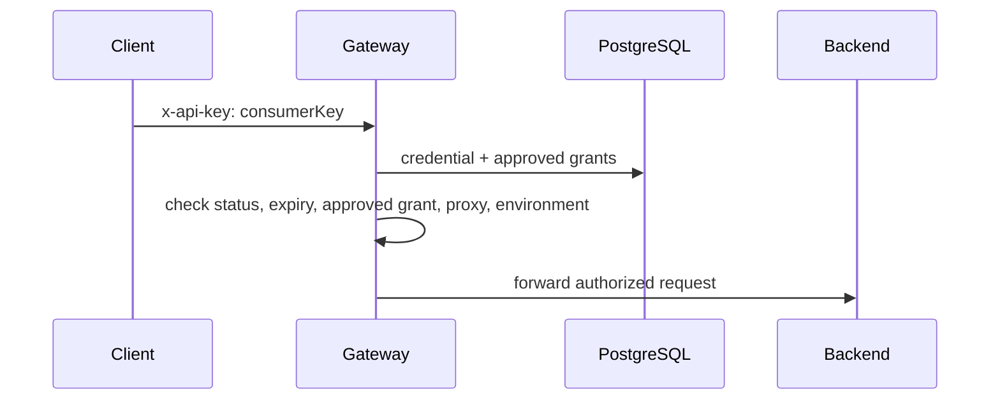
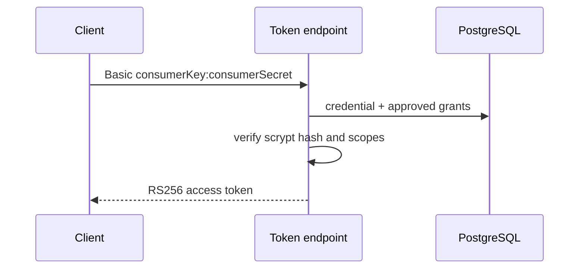
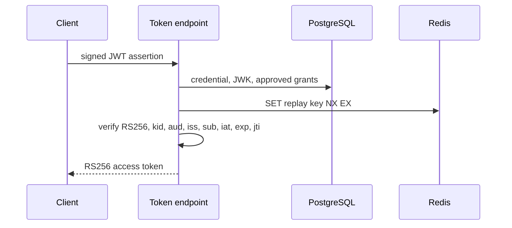
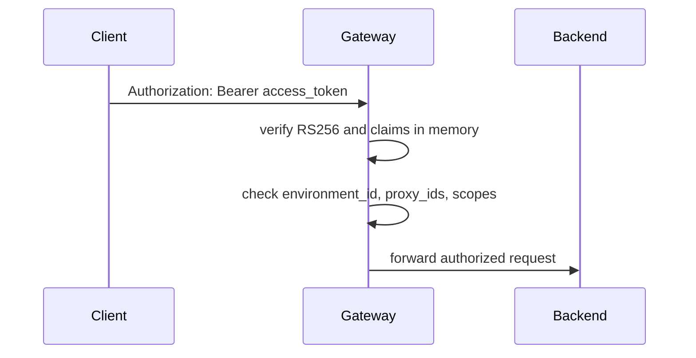
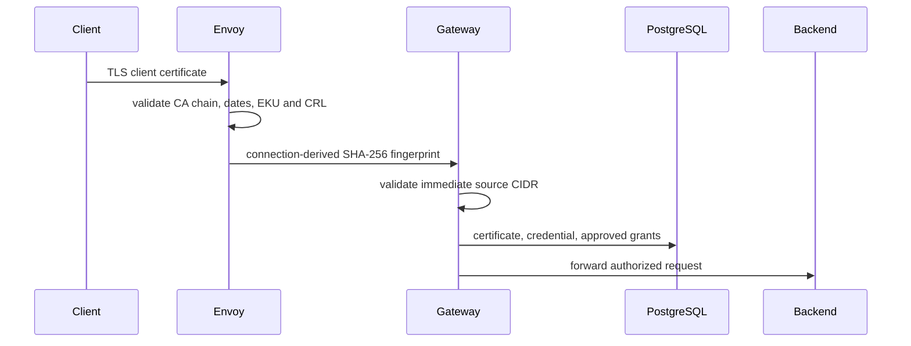

# Authentication and Authorization

> [!summary] At a glance
> Applications own credentials; credentials authenticate clients; approved product grants authorize proxies, environments, and scopes. OAuth exchanges supported client authentication for short-lived, environment-bound RS256 access tokens.

## Context

The gateway supports four client-facing methods:

- API key: `consumerKey` in a configurable header.
- OAuth Client Credentials: `consumerKey` and a one-time-issued secret.
- OAuth JWT Bearer Grant: a short-lived assertion signed by an application key.
- Direct mTLS: a certificate validated by a trusted ingress.

Authentication and authorization are separate. A valid credential does not
grant API access until it has an approved `CredentialProductGrant`.

## Components

`AppCredential` is the common identity anchor. Every credential has a generated
consumer key and a generated secret whose salted scrypt hash is the only stored
form. The selected endpoint policy determines how that credential is used:
API key resolves the consumer key, Client Credentials also verifies the secret,
JWT Bearer requires an active `AppPublicKey`, and mTLS requires an active
`AppCertificate`. Public JWKs and certificates are optional, independently
revocable records with validity windows.

Application registration creates the app, its initial credential, and approved
product grants in one transaction. The plaintext consumer secret appears only
in the creation response. A failed product or scope validation rolls back the
entire aggregate.

The system-managed `platform-oauth` proxy exposes local endpoints at
`POST /oauth/token` and `GET /oauth/.well-known/jwks.json` in every environment.
Local endpoints return from a terminal policy and never invoke an upstream.

## Data Flow

### API Key

### Client Credentials

### JWT Bearer Grant

### Access Token

### Direct mTLS

## Failure Modes

| Failure | Behavior |
| --- | --- |
| PostgreSQL unavailable during API key, token issuance, or mTLS | Policy `failureMode`; security policies default closed |
| Redis unavailable during JWT assertion replay protection | Reject `invalid_grant`; always fail closed |
| Invalid signing key or trusted CIDR configuration | Gateway startup fails; readiness is never reached |
| Invalid access-token signature or claims | `401` |
| Valid token for another environment, proxy, or missing scope | `403` |
| Credential, grant, JWK, or certificate revoked | New DB-backed authentication fails immediately |
| Access token revoked indirectly after issuance | Remains valid until `exp` |

## Constraints

- RS256 only.
- Access tokens default to 900 seconds and cannot exceed 3600 seconds.
- JWT assertions cannot span more than 120 seconds and are single-use.
- No refresh tokens or individual access-token persistence/revocation.
- One authentication policy per business endpoint.
- Envoy removes client-supplied identity headers and writes the fingerprint
  derived from the live TLS connection.
- Client private keys never enter the platform; managed issuance accepts CSRs.
- Authorization code, password, implicit, `private_key_jwt`, and direct external
  JWT validation are not supported.

## Sources

- [[Data Model]]
- [[Runtime Request Flow]]
- [[OAuth 2.0]]
- [[ADR-005 Signed OAuth Tokens]]
- [[Multi-Client PKI]]
