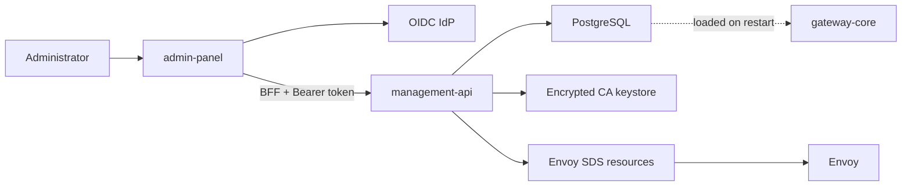
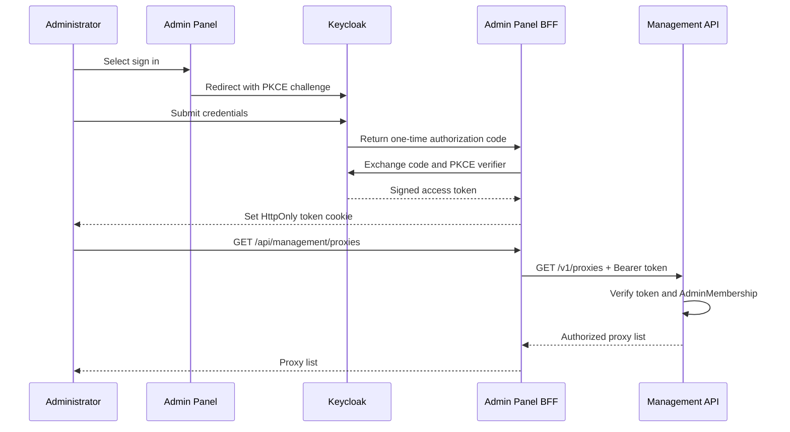

# Control Plane Flow

> [!summary] At a glance
> The control plane provides OIDC-protected revision deployment, application registration, PKI administration, and audit; product administration and hot reload remain planned.

## Context

The control plane combines `admin-panel`, Keycloak or a replaceable OIDC IdP,
`management-api`, PostgreSQL, the encrypted CA keystore, and Envoy SDS.

## Components

### Responsibilities

| Component | Responsibility |
| --- | --- |
| Keycloak | Authenticates the administrator and issues a signed OIDC access token. |
| Admin Panel | Renders the browser interface and starts the login flow. |
| BFF | Runs inside Admin Panel, stores the token in an HttpOnly cookie, and forwards browser requests with that token. |
| Management API | Validates the token and applies role and organization permissions before reading or changing configuration. |
| PostgreSQL | Stores memberships, roles, proxy configuration, applications, certificates, and audit events. |

The BFF, or Backend For Frontend, is not an additional deployed service. It is
the set of server-side routes under `admin-panel/app/api`. The browser calls
`/api/management/*` on Admin Panel, and the BFF translates that request to the
internal `/v1/*` Management API. Management API is therefore not exposed
directly to browser-side JavaScript.

Keycloak answers **who the administrator is**. It validates the login and signs
an access token. Management API answers **what that administrator may do** by
matching the token identity against `AdminMembership` records and enforcing the
stored role and organization boundary.

## Data Flow

PKCE binds the login attempt to a random verifier temporarily stored by Admin
Panel. An intercepted authorization code cannot be exchanged without that
verifier. After the exchange, the short-lived access token is stored in an
`HttpOnly` cookie: the browser sends the cookie automatically, but client-side
JavaScript cannot read it.

For each management request, the BFF reads the cookie on the server, adds
`Authorization: Bearer <token>`, and forwards the method, query, content type,
and body to Management API. The BFF does not grant permissions. Management API
verifies the token signature, issuer, audience, and expiration, then checks the
database membership and role before running the requested operation.

Proxy imports compile OpenAPI and gateway configuration atomically; deployment
activation persists desired routing and requires gateway restart. CA/CRL
changes continue to publish dynamically to Envoy.

## Failure Modes

- Publishing before a committed database write could reload incomplete state.
- Direct Prisma writes could bypass deployment progression invariants.
- A reload event without snapshot validation could make the data plane unavailable.
- A database mutation followed by runtime publication failure can temporarily
  diverge persisted and active trust.

## Constraints

PKI and proxy revision APIs are implemented. Product and proxy web pages remain
contextual placeholders, and Redis-based routing hot reload remains a design.

## Sources

See [[Management API]], [[management-api]], [[admin-panel]], and
[[Hot Reload Sync]].
