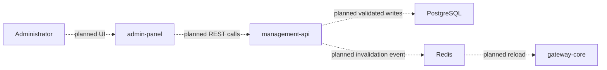

# Control Plane Flow

> [!summary] At a glance
> The intended control plane manages gateway configuration, but today it consists only of scaffolds and a Management API health endpoint.

## Context

The target control plane combines `admin-panel` and `management-api`. Its design
must not be confused with current functionality.

## Components

## Data Flow

The planned flow validates commands against shared contracts, performs
transactional database writes, and only then publishes configuration
invalidation. The gateway would reload a complete validated snapshot.

## Failure Modes

- Publishing before a committed database write could reload incomplete state.
- Direct Prisma writes could bypass deployment progression invariants.
- A reload event without snapshot validation could make the data plane unavailable.
- Authentication and authorization for administrative operations are not implemented.

## Constraints

Current CRUD route files contain stubs. `admin-panel` pages contain placeholder
headings. Redis hot reload remains a design only.

## Sources

See [[Management API]], [[management-api]], [[admin-panel]], and
[[Hot Reload Sync]].
