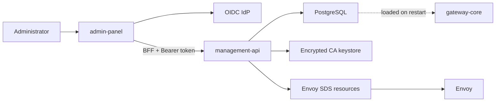

# Control Plane Flow

> [!summary] At a glance
> The control plane provides OIDC-protected revision deployment, application registration, PKI administration, and audit; product administration and hot reload remain planned.

## Context

The control plane combines `admin-panel`, Keycloak or a replaceable OIDC IdP,
`management-api`, PostgreSQL, the encrypted CA keystore, and Envoy SDS.

## Components

## Data Flow

Authorization Code with PKCE creates an HttpOnly panel session. The BFF sends
the access token to Management API, which validates identity and database
membership before proxy, deployment, application, or PKI mutations. Proxy
imports compile OpenAPI and gateway configuration atomically; deployment
activation persists desired routing and requires gateway restart. CA/CRL
changes continue to publish dynamically to Envoy.

## Failure Modes

- Publishing before a committed database write could reload incomplete state.
- Direct Prisma writes could bypass deployment progression invariants.
- A reload event without snapshot validation could make the data plane unavailable.
- A database mutation followed by runtime publication failure can temporarily
  diverge persisted and active trust.

## Constraints

PKI and proxy revision APIs are implemented. Product and proxy web pages remain
contextual placeholders, and Redis-based routing hot reload remains a design.

## Sources

See [[Management API]], [[management-api]], [[admin-panel]], and
[[Hot Reload Sync]].
