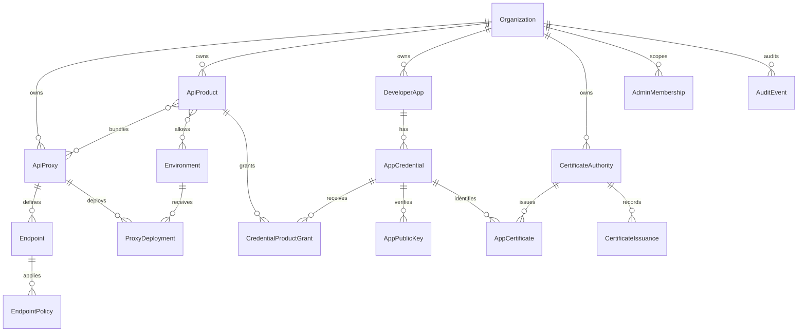

# Data Model

> [!summary] At a glance
> PostgreSQL stores gateway configuration, separating reusable logical proxies from their environment-specific deployments and authorization products.

## Context

The database stores organizations, logical proxies, endpoints, policies,
environments, deployments, API products, developer applications, and
credentials. It does not store proxied business data or request bodies.

## Components

## Deployment Flow

`ApiProxy` is a logical definition. `ProxyDeployment` connects that proxy to an
`Environment` and supplies its `upstreamBaseUrl`. The same proxy can therefore
use different upstreams in `qual`, `pprod`, and `prod`.

`createProxyDeployment()` enforces progression within the same region:

- `qual` has no prerequisite.
- `pprod` requires an existing `qual` deployment.
- `prod` requires an existing `pprod` deployment.

## Authorization Flow

An `AppCredential` identifies one application through a generated consumer key
and secret. Only the scrypt secret hash is persisted. Authentication capability
is inferred from the material required by the endpoint policy: the base
credential supports API key and Client Credentials, while public RSA JWKs and
mTLS certificates are optional validity-controlled records. An approved
`CredentialProductGrant` supplies scopes and access through an active product.
A product must include the current proxy. Its environment relation is optional:
empty means all environments.

A `CertificateAuthority` is managed or external and moves through
`draft`, `active`, `retiring`, and `revoked`. PostgreSQL stores public
certificate, CRL, validity, and key reference; managed private keys live only
in the encrypted keystore. `CertificateIssuance` records a CSR SHA-256 digest.
`AdminMembership` maps an OIDC issuer/subject to a platform or organization
role, while `AuditEvent` records security mutations append-only.

Endpoints are either `forward` or `local`. `targetPath` and an upstream are
required only for forwarding. `systemManaged` identifies platform-owned
proxies such as `platform-oauth`.

## Failure Modes

- Duplicate proxy base paths are rejected globally.
- Duplicate proxy/environment deployments are rejected.
- Invalid deployment progression raises `DeploymentProgressionError`.
- Unsupported upstream protocols are rejected before persistence.

## Constraints

Stages and regions are closed catalogs. Adding a value requires coordinated
changes to Prisma, shared contracts, migrations, seeds, tests, and documentation.

## Sources

Use [[Database Schema]] for field-level reference and [[database]] for package
ownership.
