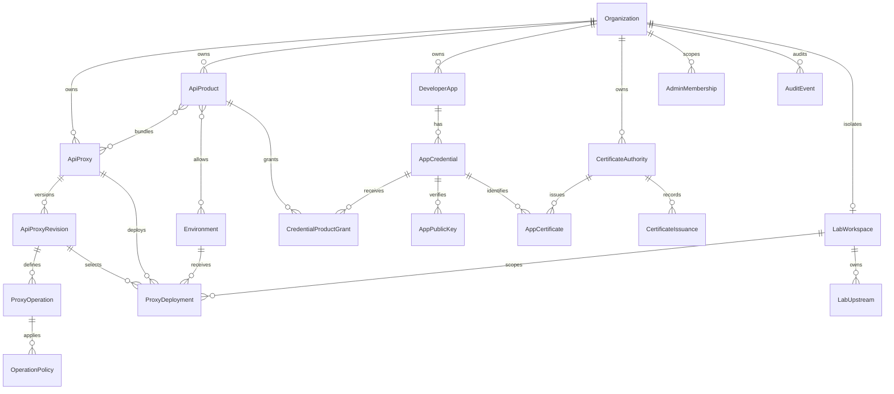

# Data Model

> [!summary] At a glance
> PostgreSQL separates stable logical proxies, immutable functional revisions, environment deployments with history, and authorization products.

## Context

The database stores organizations, logical proxies, immutable revisions,
operations, policies, environments, deployment history, API products,
developer applications, and credentials. It does not store proxied business
data, request bodies, access tokens, or client private keys.

## Components

## Deployment Flow

`ApiProxy` is a stable logical identity used by products and authorization.
`ApiProxyRevision` is an immutable OpenAPI and gateway-configuration bundle.
`ProxyDeployment` connects one exact revision to an `Environment` and supplies
its `upstreamBaseUrl`.

Each environment also owns one unique HTTPS `publicOrigin`. The gateway uses
its authority to select the environment before resolving a proxy path.

`deployProxyRevision()` enforces progression for the same revision and region:

- `qual` has no prerequisite.
- `pprod` requires an active or retired `qual` deployment of that revision.
- `prod` requires an active or retired `pprod` deployment of that revision.

Only one deployment can be active for a proxy/environment. Activating another
revision retires the current row and creates a new row. Deploying an older
revision is therefore an auditable rollback, not reactivation of old state.
The same deployment transaction creates a monotonic `GatewayConfigChange`
outbox row. Its polymorphic resource fields identify deploy, rollback,
retirement, or logical-proxy activation without coupling the outbox to one
specific table.

A `LabWorkspace` binds one hidden `Organization(kind = lab)` to an OIDC issuer
and subject, unique hostname, status, and 24-hour expiry. Lab deployments carry
`labWorkspaceId`, so the active-row and base-path conflict boundary becomes
workspace + proxy + environment instead of the standard global environment
scope. `LabUpstream` belongs to exactly one workspace and stores either a
declarative mock or a public HTTPS target consumed only through `lab-egress`.

## Authorization Flow

An `AppCredential` identifies one application through a globally unique,
generated or administrator-customized consumer key and secret. Only the scrypt
secret hash is persisted. A credential can be cloned from another active
credential in the same app; only approved grants, scopes, and expiration are
copied. Authentication capability
is inferred from the material required by the endpoint policy: the base
credential supports API key and Client Credentials, while public RSA JWKs and
mTLS certificates are optional validity-controlled records. An approved
`CredentialProductGrant` supplies scopes and access through an active product.
A product must include the current proxy. Its environment relation is optional:
empty means all environments.

A `CertificateAuthority` is managed or external and moves through
`draft`, `active`, `retiring`, and `revoked`. PostgreSQL stores public
certificate, CRL, validity, and key reference; managed private keys live only
in the encrypted keystore. `CertificateIssuance` records a CSR SHA-256 digest.
`AdminMembership` maps an OIDC issuer/subject to a platform or organization
role, while `AuditEvent` records security mutations append-only.
`AppCredential.purpose` distinguishes normal, one-hour Playground clone, and
lab credentials without changing how endpoint policies select authentication.

Operations are either `forward` or `local`. `targetPath` and an upstream are
required only for forwarding. Method and public path come from OpenAPI;
policies and target mapping come from gateway configuration. `systemManaged`
identifies platform-owned proxies such as `platform-oauth`.

## Failure Modes

- Duplicate active base paths are rejected within one environment.
- Duplicate environment public origins are rejected.
- Duplicate workspace hostnames and multiple active workspaces for the same
  OIDC owner are rejected by database constraints.
- A partial PostgreSQL index rejects multiple active proxy/environment rows.
- Invalid revision progression raises `ProxyDeploymentError` with
  `promotion_required`.
- Unsupported upstream protocols are rejected before persistence.
- Bundle validation failures create no revision or operations.

## Constraints

Stages and regions are closed catalogs. Adding a value requires coordinated
changes to Prisma, shared contracts, migrations, seeds, tests, and documentation.

## Sources

Use [[Database Schema]] for field-level reference and [[database]] for package
ownership. See [[Proxy Revisions and Deployments]] for the standard lifecycle
and [[Personal Gateway Lab]] for workspace-scoped behavior.
