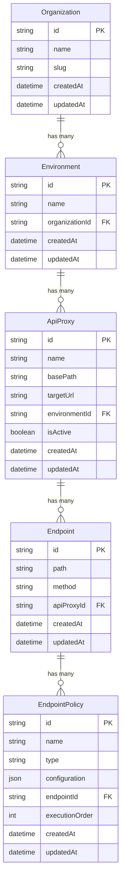
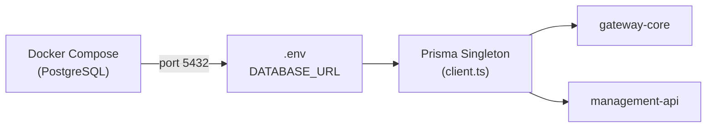

# 🗄️ Database and Prisma

## What the Database Stores

The PostgreSQL database stores **only gateway configuration data** — it defines which API proxies exist, what endpoints they expose, and what policies apply to each endpoint.

> [!IMPORTANT]
> The database does **NOT** store API consumer data, request logs, or user authentication data. It is purely a **configuration store**.

### ✈️ The Airport Analogy

Think of the database as the **flight information board** at an airport — not the planes themselves.

| Airport | API Gateway |
| ------- | ----------- |
| Flight board | Database |
| Flights listed | API Proxies & Endpoints |
| Gate assignments | Routing rules |
| Actual planes | HTTP requests from clients |

The board tells you where things go. It doesn't carry passengers.

---

## Entity Relationship Diagram



### Hierarchy

```
Organization (e.g., "Acme Corp")
  └── Environment (e.g., "production", "staging")
       └── ApiProxy (e.g., "banking-v1", basePath: "/es/banking/v1")
            └── Endpoint (e.g., path: "/accounts/:id", method: "GET")
                 └── EndpointPolicy (e.g., "rate-limit", "api-key-verify")
```

---

## Connection Flow



1. **Docker Compose** starts PostgreSQL on port `5432`
2. The `.env` file contains the `DATABASE_URL` connection string
3. The **Prisma Singleton** in `packages/database/src/client.ts` creates a single shared `PrismaClient` instance
4. Both `gateway-core` and `management-api` import the singleton from `@api-gateway/database`

---

## Singleton Pattern

The database package exports a **single instance** of `PrismaClient` that is reused across the entire application. This prevents creating multiple database connections and avoids connection pool exhaustion.

```typescript
// packages/database/src/client.ts
import { PrismaClient } from '@prisma/client';

const prisma = new PrismaClient();

export default prisma;
```

> [!TIP]
> The singleton ensures that even if multiple modules import the client, they all share the same connection pool.

---

## Available Scripts

| Script | Command | Purpose |
| ------ | ------- | ------- |
| `db:generate` | `npx prisma generate` | Generate the Prisma Client from schema |
| `db:migrate` | `npx prisma migrate dev` | Run pending migrations |
| `db:seed` | `npx prisma db seed` | Seed the database with sample data |
| `db:reset` | `npx prisma migrate reset` | Reset DB, re-run migrations + seed |
| `db:studio` | `npx prisma studio` | Open visual DB browser (port 5555) |

---

## Related Pages

- [[ADR-003 Prisma as ORM]]
- [[database]]
- [[How to Use Prisma Studio]]
