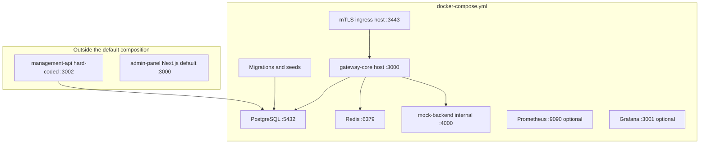

# Deployment Model

> [!summary] At a glance
> The local data plane is an ordered Docker Compose application started through `npm run dev:local`; control-plane scaffolds remain outside it.

## Context

The repository does not yet define a production deployment topology. The
current model is a reproducible local-development composition for the complete
data plane. The Management API and Admin Panel remain independently started
scaffolds.

## Components

## Data Flow

`npm run dev:local` generates untracked cryptographic material and invokes
Compose. Health and completion dependencies enforce PostgreSQL, migrations,
seeds, Redis, mock backend, gateway, and ingress startup order. The gateway
selects deployments from PostgreSQL and forwards to the internal mock service.
Prometheus and Grafana require the optional `observability` profile.

## Failure Modes

- Starting all workspaces through the root `dev` script can fail because the
  standalone Admin Panel and gateway both default to port `3000`.
- A failed one-shot `database-setup` blocks gateway startup.
- Removing `.local-secrets/` while containers are running desynchronizes mounted
  mTLS material until the environment is recreated.
- Management API validates a `PORT` variable in one module but its current server still listens on hard-coded port `3002`.

## Constraints

This composition is a development topology and does not define production
secret management, scaling, ingress, or port allocation.

## Sources

See [[How to Start the Project]] for setup steps and [[Environment Variables]]
for configurable process values.
