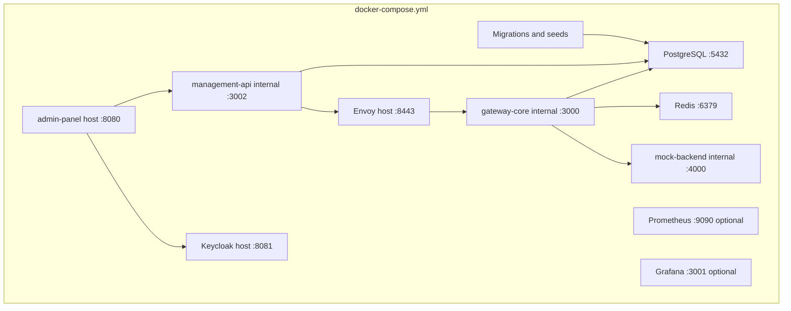

# Deployment Model

> [!summary] At a glance
> `npm run dev:local` builds and starts the complete local data plane, OIDC control plane, encrypted PKI runtime, and web interface as one Docker Compose application.

## Context

The repository does not yet define a production deployment topology. The
current model is a reproducible local-development composition for the platform.

## Components

## Data Flow

`npm run dev:local` generates untracked cryptographic material and invokes
Compose. Health and completion dependencies enforce PostgreSQL, migrations,
seeds, Redis, Keycloak, mock backend, gateway, Management API, panel, and ingress
startup order. The gateway loads all active deployments from PostgreSQL,
including each immutable revision's base path, operations, and policies. It
selects the environment from the request hostname and forwards to the
deployment-specific upstream. Retired deployment rows remain as history but
are never loaded by the runtime. Local origins follow
`https://<stage>-<region>.gateway.localhost:8443`.
Prometheus and Grafana require the optional `observability` profile.

## Failure Modes

- A failed one-shot `database-setup` blocks gateway startup.
- Removing `.local-secrets/` while containers are running desynchronizes mounted
  mTLS material until the environment is recreated.
- A stale Keycloak volume does not re-import a changed local realm; use the
  documented volume reset when bootstrap definitions change.
- Importing or deploying a revision does not refresh a running gateway; restart
  it to load the new active deployment set.

## Constraints

This composition is a development topology and does not define production
secret management, scaling, ingress, or port allocation.
Gateway, Management API, PostgreSQL, Redis, and mock backend are intentionally
not published to the host.

## Sources

See [[How to Start the Project]] for setup steps, [[Environment Variables]] for
configurable process values, and [[ADR-007 Hostname-Based Environment Routing]]
for environment selection.
