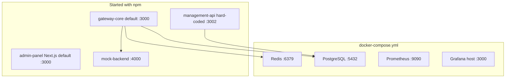

# Deployment Model

> [!summary] At a glance
> Docker Compose currently provides shared infrastructure, while application processes are started separately and require manual port coordination.

## Context

The repository does not yet define a production deployment topology. The
current model is a local-development composition plus independently started npm
workspace processes.

## Components

## Data Flow

Infrastructure can start with `docker compose up`. Application processes use
their workspace scripts and are not Compose services. The gateway selects
deployments from PostgreSQL and forwards to each configured upstream.

## Failure Modes

- Grafana, gateway-core, and the default Next.js server all claim host port `3000`.
- Starting all workspaces through the root `dev` script can therefore fail with `EADDRINUSE`.
- Management API validates a `PORT` variable in one module but its current server still listens on hard-coded port `3002`.

## Constraints

This note reports current behavior; it does not reserve a target production port
map. See [[Ports]] before starting multiple services locally.

## Sources

See [[How to Start the Project]] for setup steps and [[Environment Variables]]
for configurable process values.
