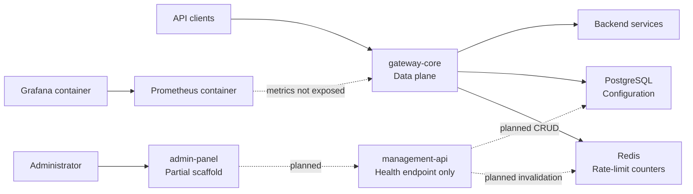

# Global Architecture

> [!summary] At a glance
> The platform separates request processing in `gateway-core` from a partially built control plane, with PostgreSQL as configuration storage and Redis currently used for rate limiting.

## Context

The repository is an npm-workspaces monorepo. Its target architecture follows
the data-plane/control-plane split used by enterprise API gateways, but the two
planes have different implementation maturity.

## Components

## Current Data Flow

1. `gateway-core` validates its environment and loads active deployments from PostgreSQL.
2. The gateway builds an in-memory registry of proxies, endpoints, and validated policy configuration.
3. Incoming requests resolve against that registry.
4. Registered policies may allow, reject, rate-limit, or degrade the request.
5. Allowed requests are forwarded to the deployment-specific upstream.

The configuration is not reloaded while the process is running.

## Failure Modes

- Invalid environment or policy configuration prevents gateway startup.
- An unknown proxy or endpoint returns a gateway-generated `404`.
- An unreachable upstream returns `502`.
- Policy infrastructure failures follow each policy's `failureMode`.
- Multiple active deployments with the same `basePath` require an explicit `GATEWAY_ENVIRONMENT_ID`.

## Constraints

- `gateway-core` reads configuration but does not provide management CRUD.
- The Management API and Admin Panel are not usable control-plane products yet.
- Docker Compose starts infrastructure only; application services are still TODO entries.
- Local port defaults conflict and must be coordinated manually.

## Sources

See [[Runtime Request Flow]], [[Control Plane Flow]], [[Deployment Model]],
[[Observability]], and [[Current Status]] for focused views of the architecture.
