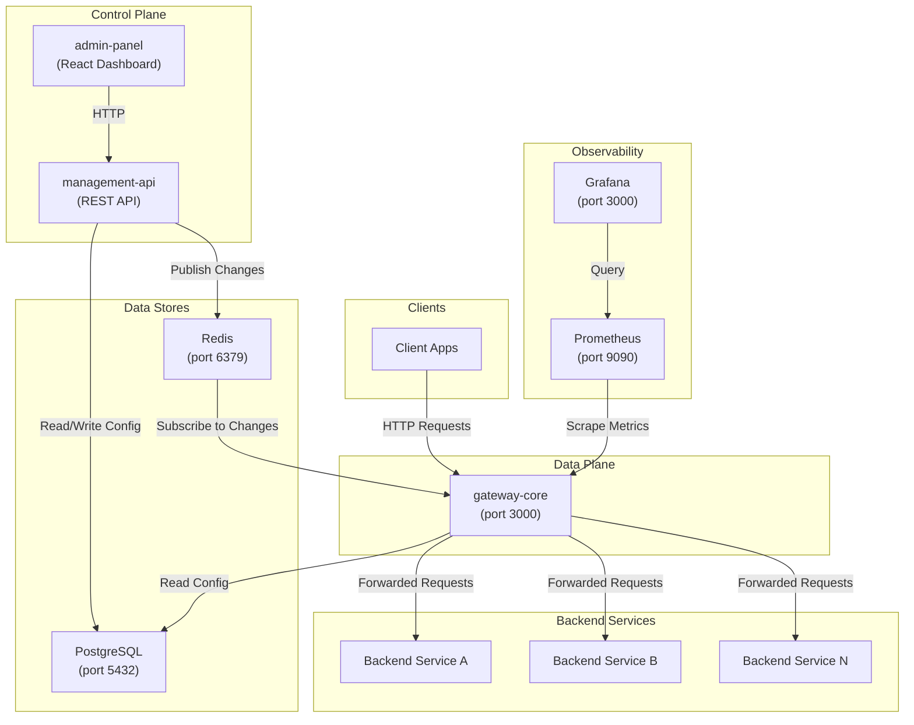

# 🏗️ Global Architecture

## Overview

The **API Gateway Platform** is a monorepo that implements a lightweight API Gateway inspired by enterprise platforms like Apigee. It consists of multiple packages that work together to receive, route, and forward API traffic to backend services while providing centralized configuration management.

The platform follows a clear separation between the **Data Plane** (request processing) and the **Control Plane** (configuration management).

---

## Architecture Diagram

---

## Component Descriptions

### 🔀 gateway-core (Data Plane)

The runtime engine that receives all incoming API traffic. It resolves which proxy and endpoint match the request, then forwards it to the appropriate backend service using `undici`. It does **not** manage configuration — it only reads it.

- **Port:** `3000`
- **Role:** Receive → Resolve → Forward

### 🛠️ management-api (Control Plane)

A REST API for managing gateway configuration (proxies, endpoints, policies). It reads and writes to PostgreSQL and publishes change notifications to Redis so the gateway can reload its configuration without restarting.

### 🖥️ admin-panel (Control Plane UI)

A React-based dashboard that communicates with the `management-api` over HTTP. Provides a visual interface for managing API proxies, endpoints, and policies.

### 🐘 PostgreSQL

Stores all gateway **configuration data** — organizations, environments, API proxies, endpoints, and policies. This is NOT a data store for API consumer data.

### 🔴 Redis

Acts as a **message bus** between the Control Plane and Data Plane. When configuration changes are saved via `management-api`, a notification is published to Redis. The `gateway-core` subscribes and reloads its routing configuration in real time.

### 📊 Prometheus + Grafana

Prometheus scrapes metrics from the gateway. Grafana provides dashboards and visualizations for monitoring gateway health, request rates, latencies, and errors.

---

## Infrastructure (Docker Compose)

| Service      | Port  | Purpose                    |
| ------------ | ----- | -------------------------- |
| PostgreSQL   | 5432  | Configuration database     |
| Redis        | 6379  | Pub/Sub message bus        |
| Prometheus   | 9090  | Metrics collection         |
| Grafana      | 3000  | Metrics visualization      |
| gateway-core | 3000  | API traffic processing     |
| mock-backend | 4000  | json-server for dev/testing|

---

## Related Pages

- [[Data Plane vs Control Plane]]
- [[Monorepo and Packages]]
- [[database]]
- [[gateway-core]]
