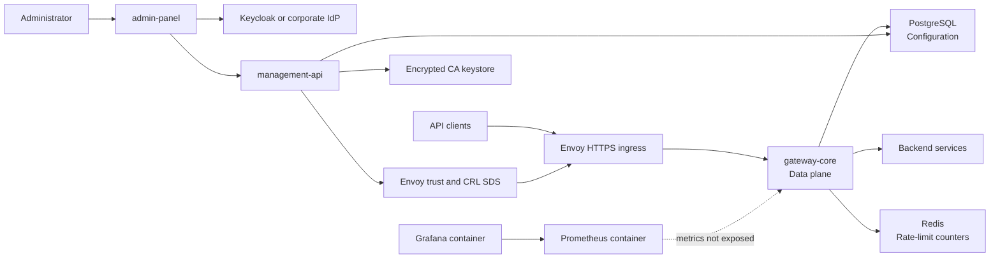

# Global Architecture

> [!summary] At a glance
> The platform runs a data plane behind Envoy and an OIDC-protected control plane for organization-scoped certificate lifecycle, with PostgreSQL, Redis, Keycloak, and encrypted local PKI storage.

## Context

The repository is an npm-workspaces monorepo. Its target architecture follows
the data-plane/control-plane split used by enterprise API gateways, but the two
planes have different implementation maturity.

## Components

## Current Data Flow

1. `gateway-core` validates its environment and loads active deployments from PostgreSQL.
2. The gateway builds an in-memory registry of proxies, endpoints, and validated policy configuration.
3. Incoming requests resolve against that registry.
4. Registered policies may allow, reject, rate-limit, or degrade the request.
5. Allowed requests are forwarded to the deployment-specific upstream.
6. Administrators authenticate with OIDC; the BFF forwards their Bearer token
   to Management API.
7. Management API enforces database memberships and organization boundaries for
   CA and certificate operations.

The configuration is not reloaded while the process is running.

## Failure Modes

- Invalid environment or policy configuration prevents gateway startup.
- An unknown proxy or endpoint returns a gateway-generated `404`.
- An unreachable upstream returns `502`.
- Policy infrastructure failures follow each policy's `failureMode`.
- Multiple active deployments with the same `basePath` require an explicit `GATEWAY_ENVIRONMENT_ID`.

## Constraints

- `gateway-core` reads configuration but does not provide management CRUD.
- Control-plane CRUD is currently limited to organizations, apps, CAs,
  certificates, PKI status, and audit context.
- Proxy, product, and general application CRUD remain outside this phase.
- The local file keystore and file SDS must be replaced for production.

## Sources

See [[Runtime Request Flow]], [[Control Plane Flow]], [[Deployment Model]], [[Multi-Client PKI]],
[[Observability]], and [[Current Status]] for focused views of the architecture.
