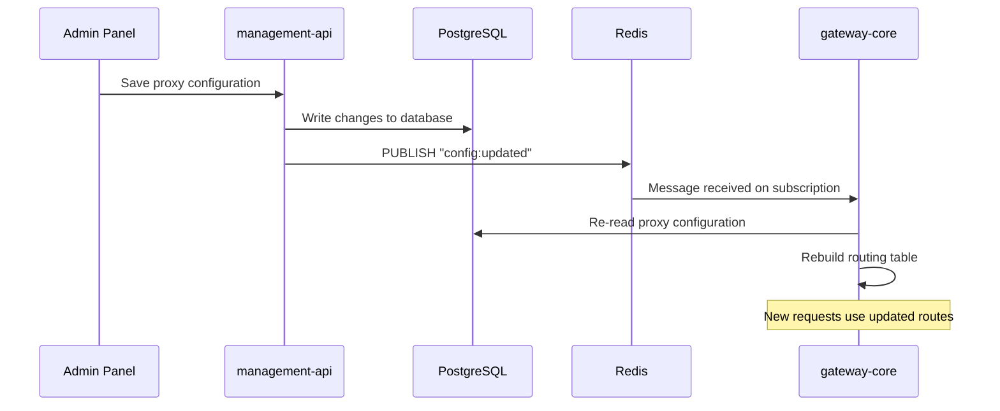

# 🔄 Hot Reload Sync

> [!WARNING]
> 🔲 **Not Yet Implemented** — This feature is planned but has not been built yet.

## Overview

Hot Reload Sync is the mechanism that will allow the gateway to **automatically reload its routing configuration** when changes are made through the Management API, without requiring a restart.

---

## Planned Architecture: Redis Pub/Sub

The synchronization between the Control Plane and Data Plane will use **Redis Pub/Sub** as a lightweight message bus.

### Flow

### Step-by-Step

1. **Admin saves** — A user modifies a proxy, endpoint, or policy via the admin panel
2. **management-api writes to PostgreSQL** — The change is persisted to the database
3. **management-api publishes to Redis** — A notification is sent to the `config:updated` channel
4. **gateway-core subscribes** — The gateway receives the notification via its Redis subscription
5. **gateway-core reloads** — The gateway re-reads all proxy configurations from PostgreSQL and rebuilds its routing table

> [!NOTE]
> During the reload, the gateway continues serving requests with the **previous** configuration. The switch is atomic — once the new routing table is built, it replaces the old one.

---

## Why Redis?

| Alternative | Why Not |
| ----------- | ------- |
| Polling the database | Wasteful, adds latency, hammers PostgreSQL |
| Webhooks | Requires the gateway to expose an HTTP endpoint for control |
| File watching | Not suitable for distributed deployments |
| **Redis Pub/Sub** | ✅ Lightweight, real-time, already in the stack |

---

## Related Pages

- [[Global Architecture]]
- [[Data Plane vs Control Plane]]
