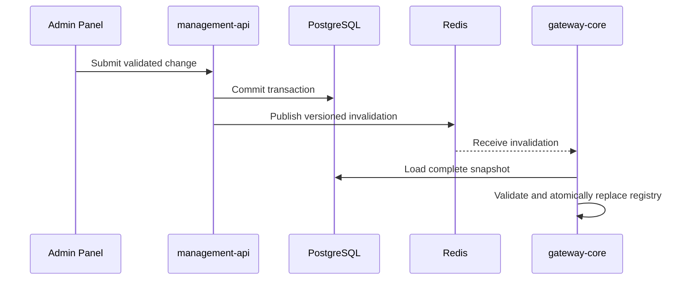

# Hot Reload Sync

> [!summary] At a glance
> Configuration hot reload is a planned Redis-based design; the gateway currently loads configuration only during startup.

## Context

Administrative changes eventually need to reach running data-plane instances
without interrupting traffic. Current code provides a replaceable in-memory
registry but no configuration subscriber or Management API publisher.

## Components

Every arrow in this sequence is planned.

## Data Flow

The database remains the source of truth. Redis should carry an invalidation or
version signal, not the full canonical configuration. Each gateway should build
and validate a complete replacement registry before swapping it into service.

## Failure Modes

- A lost Pub/Sub message can leave a gateway stale.
- Publishing before transaction commit can expose incomplete configuration.
- Invalid snapshots must not replace the last known-good registry.
- Multiple rapid changes require coalescing or version comparison.
- Reconnection must trigger reconciliation because Redis Pub/Sub is not durable.

## Constraints

The existing Redis client is lazy and policy-focused. Implementing this design
requires a separate long-lived subscription lifecycle and tests across multiple
gateway instances.

## Sources

See [[Control Plane Flow]], [[Data Plane vs Control Plane]], and
[[Current Status]].
