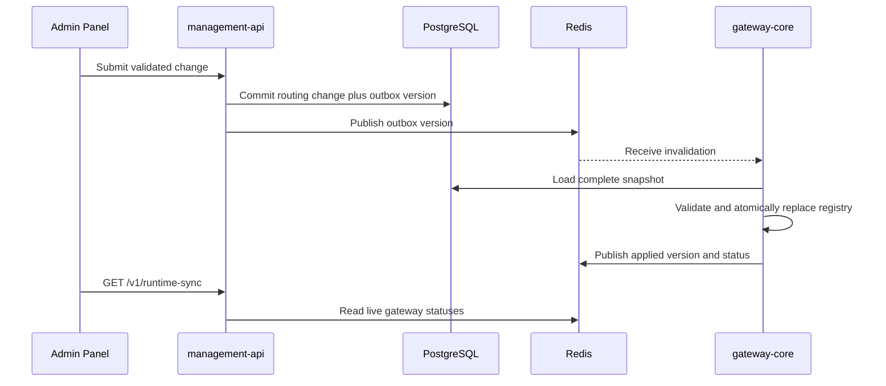

# Hot Reload Sync

> [!summary] At a glance
> Routing changes are committed with a durable outbox version, announced through Redis, and applied as validated atomic snapshots without restarting the gateway.

## Context

PostgreSQL is the configuration source of truth. Redis Pub/Sub reduces the time
between a control-plane commit and its application, while the outbox and
periodic reconciliation prevent a lost message from leaving an instance stale.

## Components

## Data Flow

Deploy, rollback, retirement, and logical proxy activation changes create
`GatewayConfigChange` inside the same transaction. Creating an undeployed proxy
or importing a revision does not create an event because no active route changed.

The Management API attempts immediate publication and retries unpublished
outbox rows periodically. Delivery is at least once. Each gateway ignores
already applied versions, serializes reloads, and coalesces bursts to the highest
requested version. It loads all active deployments allowed by
`GATEWAY_ENVIRONMENT_ALLOWLIST`, validates the complete candidate, and swaps the
two resolver maps only after success.

At startup, on Redis readiness, and every
`GATEWAY_CONFIG_RECONCILE_SECONDS`, the gateway compares its applied version
with PostgreSQL. It publishes a short-lived status under its
`GATEWAY_INSTANCE_ID`. `GET /v1/runtime-sync` returns the latest committed
version, unpublished outbox count, Redis availability, and live instances.

## Failure Modes

- Redis unavailable: the control-plane mutation succeeds and remains pending;
  reconciliation still converges through PostgreSQL when connectivity returns.
- Lost or duplicate notification: periodic version comparison recovers lost
  messages and duplicate versions are idempotent.
- Invalid snapshot: the last valid registry remains active and the instance
  publishes `state: error` with its unchanged applied version.
- Gateway offline: startup loads a full snapshot and subsequent reconciliation
  brings its version marker up to date.
- Management status Redis unavailable: the endpoint still returns PostgreSQL
  versions and reports `redisAvailable: false`.

## Constraints

The reload covers active routing, revisions, operations, and policies. Products,
grants, credentials, and certificates are queried by their authorization flows
and do not use the routing registry. Mutations do not wait for every gateway;
clients poll `runtime-sync` for asynchronous convergence.

## Sources

See [[Control Plane Flow]], [[Data Plane vs Control Plane]], and
[[Current Status]].
