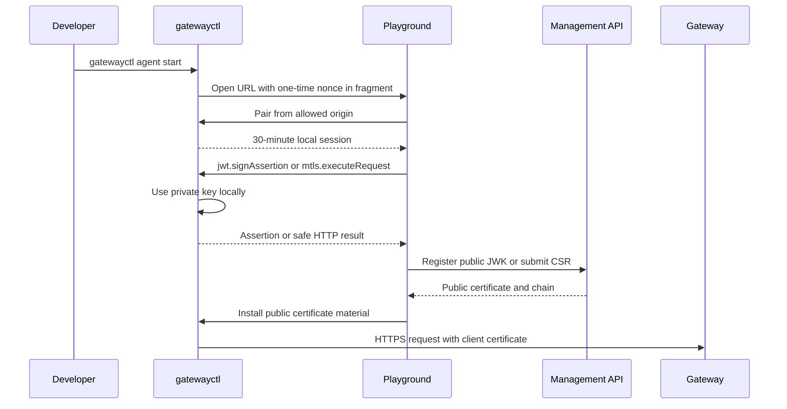

# Local Client Agent Architecture

> [!summary] At a glance
> `gatewayctl` is a closed loopback cryptographic API that lets the Playground use client-owned JWT and mTLS keys without exposing private keys, local paths, or general machine access to the browser or platform.

## Context

JWT Bearer assertions must be signed by the client and mTLS requests require the
client certificate's private key. A server-side BFF cannot perform those actions
without receiving material that must remain on the developer machine.

`gatewayctl` bridges that boundary. It is not a remote shell, filesystem browser,
or proxy for arbitrary commands.

## Components

- **CLI:** imports or generates separate JWT and mTLS identities.
- **Identity store:** keeps metadata under `GATEWAYCTL_HOME`; imported keys remain
  references to their original files and generated private keys are encrypted.
- **System keychain:** stores the AES-256-GCM master key through
  `@napi-rs/keyring`. There is no plaintext-file fallback.
- **Loopback agent:** listens on a random `127.0.0.1` port and accepts only
  configured browser origins.
- **Admin Panel client:** reads pairing data from the URL fragment, obtains a
  temporary local session, and invokes only named RPC operations.
- **Local audit:** records operation names, status, timing, and errors without
  private keys or complete assertions.

## Data Flow

The fragment is not sent to the Admin Panel server. Pairing is single-use and a
new agent connection invalidates the previous nonce. The session is bound to
the exact browser origin and renewed while the active tab uses it.

## Failure Modes

- An expired, reused, or malformed nonce returns `pairing_rejected`.
- An origin outside `GATEWAYCTL_ALLOWED_ORIGINS` is rejected before pairing.
- An expired or wrong-origin session returns `session_invalid`.
- JWT signing rejects non-RS256 identities, excessive TTL, unapproved audience,
  or a consumer key different from the identity binding.
- mTLS execution fails when the identity lacks a matching private key and
  installed certificate.
- Generated-key operations fail closed when the system keychain is unavailable.

## Constraints

- Only `agent.status`, identity listing, JWT key/JWK/assertion operations, and
  mTLS key/CSR/certificate/request operations are callable.
- Requests and responses are limited to 256 KiB at the loopback protocol.
- JWT and mTLS identities are distinct.
- The BFF never executes mTLS and the platform never receives client private
  keys.
- Allowed origins and audience host patterns must be configured for each public
  deployment; localhost defaults are development-only.

## Sources

- [[gatewayctl Reference]]
- [[How to Connect Local Keys to the Playground]]
- [[ADR-008 Closed Loopback Client Agent]]
- [[Debug Local Agent Pairing]]

