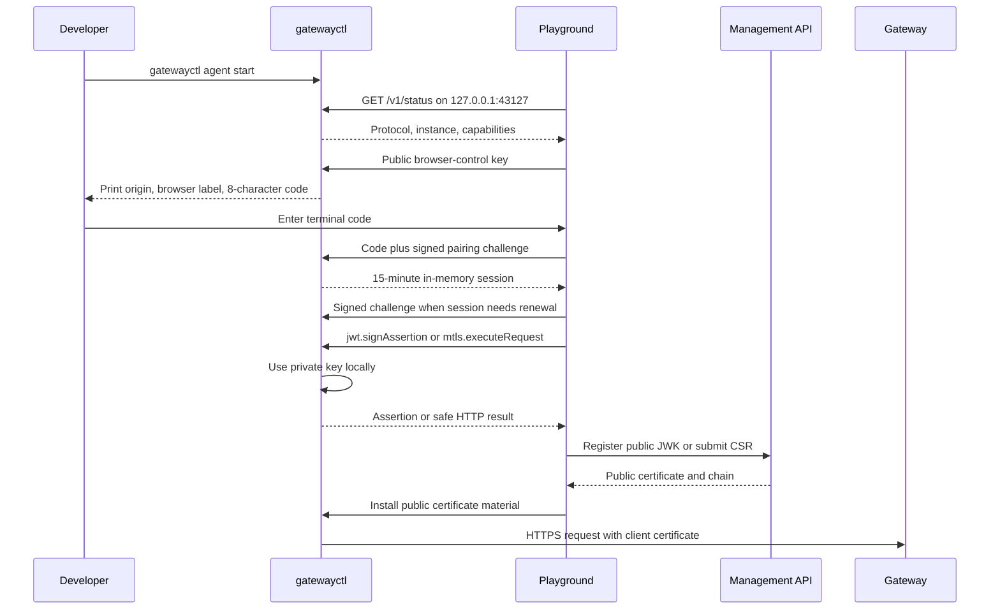

# Local Client Agent Architecture

> [!summary] At a glance
> `gatewayctl` is a closed loopback cryptographic API that lets the Playground use client-owned JWT and mTLS keys without exposing private keys, local paths, or general machine access to the browser or platform.

## Context

JWT Bearer assertions must be signed by the client and mTLS requests require the
client certificate's private key. A server-side BFF cannot perform those actions
without receiving material that must remain on the developer machine.

`gatewayctl` bridges that boundary. It is not a remote shell, filesystem browser,
or proxy for arbitrary commands.

## Components

- **CLI:** imports or generates separate JWT and mTLS identities.
- **Identity store:** keeps metadata under `GATEWAYCTL_HOME`; imported keys remain
  references to their original files and generated private keys are encrypted.
- **System keychain:** stores the AES-256-GCM master key through
  `@napi-rs/keyring`. There is no plaintext-file fallback.
- **Loopback agent:** listens on `127.0.0.1:43127` by default and accepts only
  configured browser origins.
- **Browser-control identity:** a non-exportable ECDSA P-256 key in IndexedDB
  proves that a previously approved browser is reconnecting.
- **Trusted-client registry:** stores only browser public keys, origin, label,
  expiry, and revocation state under `GATEWAYCTL_HOME`.
- **Admin Panel provider:** discovers the agent after OIDC login, owns one
  connection state for Playground and Lab, and renews short-lived sessions.
- **Local audit:** records operation names, status, timing, and errors without
  private keys or complete assertions.

## Data Flow

Pairing codes expire after two minutes and pairing/session challenges expire
after 30 seconds. The browser-control private key cannot be exported from
WebCrypto. The agent stores only hashes of 256-bit session tokens in memory;
the browser does not persist or share those tokens between tabs.

Browser trust expires absolutely after 30 days by default. Reloads, new tabs,
and agent restarts create a new 15-minute session by signing a fresh challenge.
`BroadcastChannel` only announces connection or identity changes; each tab
authenticates independently.

The browser-control identity is separate from every JWT and mTLS identity. It
can authenticate the Admin Panel to `gatewayctl`, but it cannot sign an OAuth
assertion or prove possession of a client certificate key.

## Failure Modes

- An expired, reused, malformed, or over-attempted code returns a stable pairing
  error and cannot be reused as a session challenge.
- An origin outside `GATEWAYCTL_ALLOWED_ORIGINS` is rejected before pairing.
- An expired, revoked, or wrong-origin session returns `session_invalid`.
- A protocol mismatch produces `incompatible`; an unavailable process and a
  denied Chromium Local Network Access permission are shown separately.
- A stale state file is removed only after its instance cannot be verified;
  `agent stop` never signals an unverified process.
- JWT signing rejects non-RS256 identities, excessive TTL, unapproved audience,
  or a consumer key different from the identity binding.
- mTLS execution fails when the identity lacks a matching private key and
  installed certificate.
- Generated-key operations fail closed when the system keychain is unavailable.

## Constraints

- Only `agent.status`, identity listing, JWT key/JWK/assertion operations, and
  mTLS key/CSR/certificate/request operations are callable.
- Requests and responses are limited to 256 KiB at the loopback protocol.
- JWT and mTLS identities are distinct.
- The BFF never executes mTLS and the platform never receives client private
  keys.
- Allowed origins and audience host patterns must be configured for each public
  deployment; localhost defaults are development-only.
- The fixed port can be overridden through `GATEWAYCTL_PORT`, `--port`, or the
  Admin Panel's advanced connection control.

## Sources

- [[gatewayctl Reference]]
- [[How to Connect Local Keys to the Playground]]
- [[ADR-010 Remembered Loopback Browser Clients]]
- [[Debug Local Agent Pairing]]
