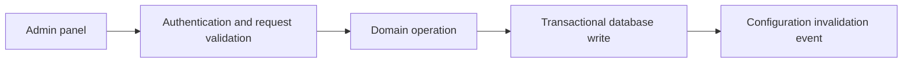

# Management API

> [!summary] At a glance
> The Management API is currently a Fastify scaffold with `GET /health`; its administrative CRUD surface is planned but not implemented.

## Context

The Management API is intended to own validated control-plane writes. It should
not be documented as functional until route handlers, authentication, tests,
and persistence behavior exist.

## Current Components

- `src/server.ts` creates a Fastify process and exposes `GET /health`.
- `src/config/env.ts` defines `PORT` and `DATABASE_URL`, but the current server
  does not call this loader and listens on hard-coded port `3002`.
- `src/routes/*.routes.ts` files are stubs.
- `admin-auth.middleware.ts` and the database wrapper are scaffolding only.

## Planned Data Flow

Planned resources include organizations, proxies, deployments, products,
developer applications, credentials, endpoints, and policies. Exact routes are
not a public contract until implemented.

## Failure Modes

- The current process will not honor the documented `PORT` environment value.
- Route files can exist without exposing any HTTP endpoint.
- Direct Prisma writes could bypass deployment progression rules.
- Administrative authentication is not implemented.

## Constraints

Only `GET /health` belongs in the current route reference. Future endpoints
must be added to [[API Routes]] from registered handlers, not design tables.

## Sources

See [[Control Plane Flow]], [[management-api]], and [[Current Status]].
