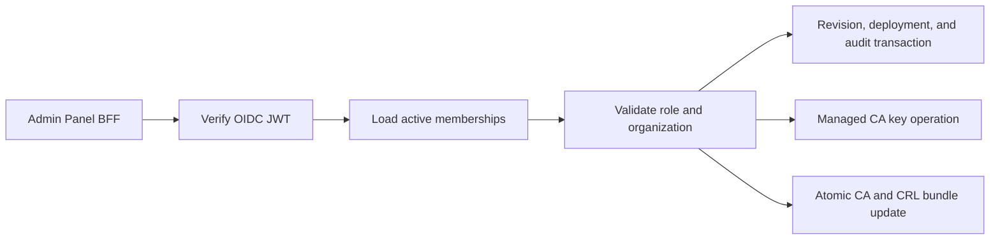

# Management API

> [!summary] At a glance
> The Management API is an internal Fastify control plane for immutable proxy revisions, deployments, application aggregates, and organization-scoped PKI.

## Context

The service owns validated security control-plane writes. It is not published
to the host; the Admin Panel BFF is its browser-facing caller.

## Current Components

- OIDC verifier: RS256, issuer, audience, expiry, and JWKS validation.
- Membership authorization: `platformAdmin`, `organizationAdmin`, and `viewer`.
- Read models for identity, organizations, environments, proxies, deployments,
  and applications.
- Logical proxy creation and multipart OpenAPI/gateway bundle import.
- Immutable revision metadata, compiled operation, and original-source reads.
- Revision-specific promotion, deployment replacement, history, and rollback.
- Transactional application registration with generated consumer key/secret and
  approved product grants.
- CA lifecycle: create/import, activate, retire, revoke, rotate, refresh/upload
  CRL.
- Certificate lifecycle: issue from CSR, register external, list, download, and
  revoke.
- PKI runtime status and append-only security audit events.

## Data Flow

Exact routes are listed in [[API Routes]]. Application registration passes
through the database domain operation so product ownership, activity, scopes,
credential generation, grants, and audit are committed or rolled back together.
Proxy configuration writes create immutable revisions. Deployments select an
existing revision and report that the gateway must restart. Products and later
credential/grant mutations remain outside this phase.

## Failure Modes

- Missing, invalid, or expired OIDC tokens return `401`.
- An identity without an active membership returns `403`.
- Organization boundary violations return `403`.
- Keystore, database, CRL, or bundle publication errors fail the mutation.
- A valid database write followed by SDS publication failure requires operator
  reconciliation from the PKI status and audit views.

## Constraints

Revision import and deployment, application registration, and certificate/PKI
mutations are implemented. Revision editing, product CRUD, credential rotation,
grant mutation, JWK routes, and routing-registry hot reload remain future work.

## Sources

See [[Control Plane Flow]], [[management-api]], [[Proxy Revisions and Deployments]],
and [[Current Status]].
