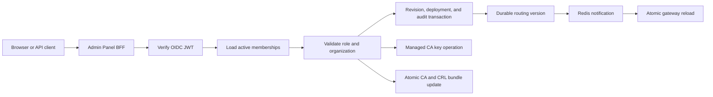

# Management API

> [!summary] At a glance
> The Management API is the internal, OIDC-protected Fastify control plane for organizations, immutable proxy revisions, deployments, products, application security aggregates, audit, and organization-scoped PKI.

## Context

The service owns validated security control-plane writes. It is not published
to the host; browsers and API clients reach it through the Admin Panel BFF.

## Current Components

- OIDC verifier: RS256, issuer, audience, expiry, and JWKS validation.
- Membership authorization: `platformAdmin`, `organizationAdmin`, and `viewer`.
- Read models for identity, organizations, environments, proxies, deployments,
  products, applications, credentials, public keys, and audit.
- Platform-admin organization creation and rename.
- Product creation and update with proxy/environment ownership checks and
  atomic scope reduction across existing grants.
- Logical proxy creation and multipart OpenAPI/gateway bundle import.
- Immutable revision metadata, compiled operation, and original-source reads.
- Revision-specific promotion, deployment replacement, history, and rollback.
- Transactional application registration with generated consumer key/secret and
  approved product grants.
- Application and credential lifecycle updates, additional credential
  generation, one-time secret rotation, desired-state grants, and RSA public
  key registration/revocation.
- Consumer-key customization and selective credential cloning.
- Durable routing outbox publication and live gateway synchronization status.
- CA lifecycle: create/import, activate, retire, revoke, rotate, refresh/upload
  CRL.
- Certificate lifecycle: issue from CSR, register external, list, download, and
  revoke.
- PKI runtime status and append-only security audit events.

## Data Flow

Exact routes are listed in [[API Routes]]. Application registration passes
through the database domain operation so product ownership, activity, scopes,
credential generation, grants, and audit are committed or rolled back together.
Proxy configuration writes create immutable revisions. Deployment, rollback,
retirement, and proxy activation mutations create an outbox version in the same
transaction and return asynchronous runtime-sync metadata. Product,
credential, grant, and public-key mutations use domain services so routes do
not reproduce persistence or security rules with direct Prisma calls.

## Failure Modes

- Missing, invalid, or expired OIDC tokens return `401`.
- An identity without an active membership returns `403`.
- Organization boundary violations return `403`.
- Keystore, database, CRL, or bundle publication errors fail the mutation.
- A valid database write followed by SDS publication failure requires operator
  reconciliation from the PKI status and audit views.
- Redis failure after a routing commit leaves an unpublished outbox row; the
  mutation remains valid and dispatch retries later.

## Constraints

The intended control-plane surface for organizations, products, proxies,
applications, credentials, grants, public keys, audit, and PKI is implemented.
Membership administration, environment catalog writes, physical deletion, and
revision editing remain outside the current boundary.

## Sources

See [[Control Plane Flow]], [[management-api]], [[Management API Endpoint Reference]],
[[How to Use the Management API with Postman]], and [[Current Status]].
