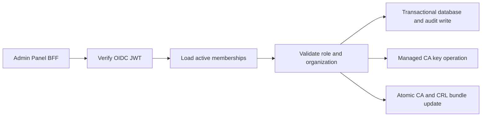

# Management API

> [!summary] At a glance
> The Management API is an internal Fastify service that verifies OIDC tokens, resolves database memberships, and manages organization-scoped certificate authorities and client certificates.

## Context

The service owns validated security control-plane writes. It is not published
to the host; the Admin Panel BFF is its browser-facing caller.

## Current Components

- OIDC verifier: RS256, issuer, audience, expiry, and JWKS validation.
- Membership authorization: `platformAdmin`, `organizationAdmin`, and `viewer`.
- Read models for current identity, organizations, and applications.
- CA lifecycle: create/import, activate, retire, revoke, rotate, refresh/upload
  CRL.
- Certificate lifecycle: issue from CSR, register external, list, download, and
  revoke.
- PKI runtime status and append-only security audit events.

## Data Flow

Exact routes are listed in [[API Routes]]. Proxy, deployment, product,
application, and credential mutations are not implemented in this phase.

## Failure Modes

- Missing, invalid, or expired OIDC tokens return `401`.
- An identity without an active membership returns `403`.
- Organization boundary violations return `403`.
- Keystore, database, CRL, or bundle publication errors fail the mutation.
- A valid database write followed by SDS publication failure requires operator
  reconciliation from the PKI status and audit views.

## Constraints

Only certificate and PKI control-plane mutations are complete. General gateway
configuration CRUD and routing-registry hot reload remain future work.

## Sources

See [[Control Plane Flow]], [[management-api]], and [[Current Status]].
