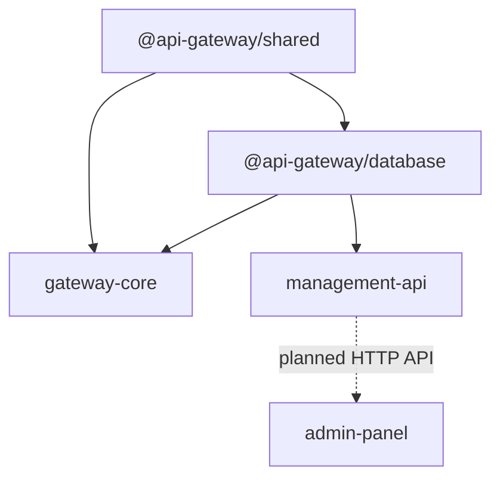

# Monorepo and Packages

> [!summary] At a glance
> npm workspaces coordinate five packages with a deliberate dependency direction from shared contracts and persistence toward runtime applications.

## Context

The root `package.json` includes every directory under `packages/*`. Root
scripts delegate build, test, lint, and development tasks to those workspaces.

## Components

| Package | Current responsibility | Status |
| --- | --- | --- |
| [[shared]] | Routing, deployment, and policy contracts | Implemented |
| [[database]] | Prisma schema, client, seeds, and deployment operation | Implemented |
| [[gateway-core]] | Routing, policy execution, and forwarding | Implemented |
| [[management-api]] | OIDC-authorized PKI control plane; general gateway CRUD remains partial | Partial |
| [[admin-panel]] | OIDC session, BFF, and PKI views; proxy/product mutation remains partial | Partial |
| [[pki]] | Keystore, X.509, CRL, bundles, and client CSR generation | Implemented |

## Data Flow

`shared` must not depend on runtime packages. `database` owns persistence.
`gateway-core` consumes validated configuration. The future Management API
should call database domain operations rather than duplicating invariants.

## Failure Modes

- Building a consumer before its internal dependencies can leave stale `dist` output.
- Root `dev` starts all available workspace dev scripts and can encounter port collisions.
- Placeholder test and lint scripts can produce a successful command without meaningful coverage.

## Constraints

Package names are not fully uniform: internal libraries use the
`@api-gateway/*` scope while application packages currently use unscoped names.
This is existing behavior, not a documentation convention.

## Sources

See each package note for boundaries and public contracts.
