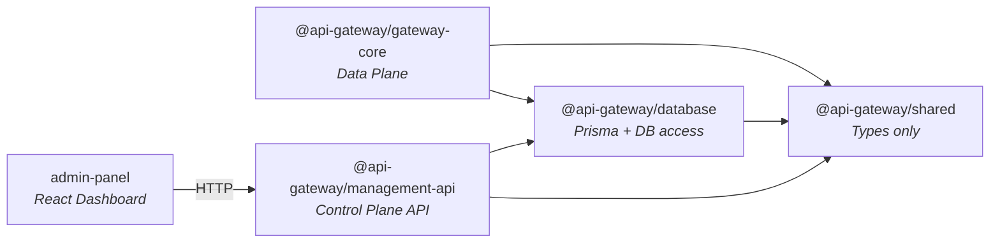

# 📦 Monorepo and Packages

## What is a Monorepo?

A **monorepo** (monolithic repository) is a single Git repository that contains multiple related projects or packages. Instead of having separate repositories for the gateway, the database layer, and the management API, everything lives together under one roof.

### Benefits

- **Shared code**: Common types and utilities are shared without publishing to npm
- **Atomic changes**: A single commit can update the gateway and the database schema together
- **Unified tooling**: One `tsconfig`, one linter config, one CI pipeline
- **Simplified dependency management**: Internal packages reference each other directly

---

## npm Workspaces

This project uses **npm workspaces** (built into npm 7+) to manage the monorepo. The root `package.json` declares workspace paths:

```json
{
  "workspaces": [
    "packages/*"
  ]
}
```

This means:
- Running `npm install` at the root installs dependencies for **all** packages
- Internal packages (e.g., `@api-gateway/shared`) are symlinked automatically
- Scripts can target specific workspaces: `npm run dev --workspace=packages/gateway-core`

---

## Package Dependency Graph



> [!NOTE]
> All arrows represent **compile-time dependencies** (npm workspace links) except `admin-panel → management-api`, which is an **HTTP runtime dependency**.

---

## Package Summary

| Package | Path | Status | Description |
| ------- | ---- | ------ | ----------- |
| **shared** | `packages/shared/` | ✅ Active | Shared TypeScript types used by all other packages |
| **database** | `packages/database/` | ✅ Active | Prisma schema, migrations, seed data, DB singleton |
| **gateway-core** | `packages/gateway-core/` | ✅ Active | Data Plane — receives and forwards API traffic |
| **management-api** | `packages/management-api/` | 🔲 Minimal | Control Plane API — planned CRUD endpoints |
| **admin-panel** | `packages/admin-panel/` | 🔲 Not Started | React dashboard for managing the gateway |

---

## Root-Level Files

| File | Purpose |
| ---- | ------- |
| `package.json` | Workspace definitions, root scripts |
| `tsconfig.base.json` | Shared TypeScript configuration |
| `docker-compose.yml` | PostgreSQL, Redis, Prometheus, Grafana |
| `.env` | Environment variables (DATABASE_URL, etc.) |
| `.gitignore` | Ignores node_modules, dist, generated files |
| `README.md` | Project overview and quick start |

---

## Related Pages

- [[gateway-core]]
- [[database]]
- [[shared]]
- [[management-api]]
- [[admin-panel]]
