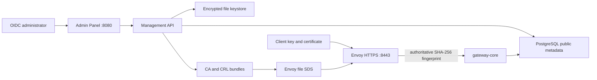
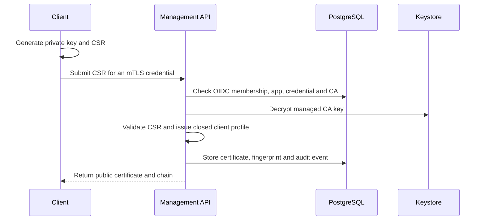
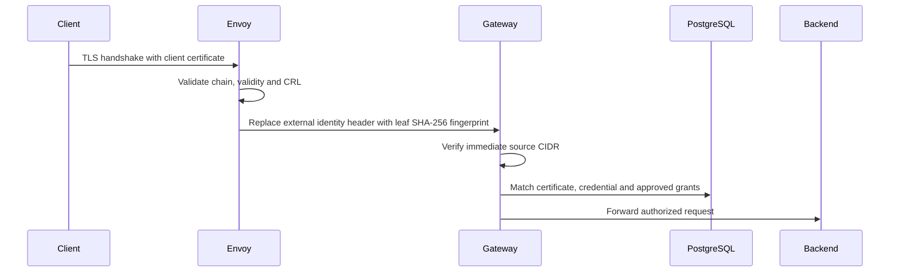

# Multi-Client PKI

> [!summary] At a glance
> Each organization can trust managed or external certificate authorities. Clients keep their private keys, submit CSRs, and present independently issued certificates to Envoy; the gateway authorizes the verified SHA-256 fingerprint.

## Context

The platform must identify multiple mTLS clients without baking one certificate
into ingress configuration. It also needs controlled issuance, external trust,
revocation, rotation, organization boundaries, and a local setup that behaves
like one product.

## Components

`CertificateAuthority` belongs to an organization. A managed authority has an
encrypted `keyRef`; an external authority stores only public certificate,
chain, and CRL metadata. `AppCertificate` links one verified certificate to one
`AppCredential`. `CertificateIssuance` records the CSR digest and result, never
the client private key.

Managed CA keys are encrypted with AES-256-GCM by `EncryptedFileKeyStore`. The
master key is a separate untracked file and key writes are atomic. Public trust
bundles, CRLs, and SDS resources contain no private key material.

## Data Flow

### Managed issuance

RSA CSRs require at least 2048 bits. EC accepts P-256 or P-384. Managed
certificates default to 90 days and cannot exceed 365 days. The profile requires
client authentication EKU and binds organization, app, and credential IDs.

### Connection authentication

Envoy accepts a client certificate optionally at the listener because the same
HTTPS ingress also serves API key and OAuth traffic. An endpoint with
`mtls-auth` still requires a valid certificate identity.

### Revocation and rotation

Revocation updates the certificate and append-only audit event, regenerates the
managed CA CRL, atomically writes public bundles, and replaces the SDS resource
to trigger Envoy reload. A `retiring` CA remains trusted but cannot issue. CA
rotation creates and activates a replacement, then marks the previous CA
`retiring` so existing clients continue working during migration.

Each Personal Lab provisions an ephemeral managed CA and a wildcard server
certificate for its lab hostname boundary. Lab client certificates are issued
from CSRs for one day and remain scoped through the owning credential and
workspace. The private key and CSR workflow is executed through
[[Local Client Agent Architecture|gatewayctl]]; only CSR, certificate, and
public chain cross the browser/platform boundary.

## Failure Modes

| Failure | Behavior |
| --- | --- |
| Unknown CA, invalid chain, expired certificate, or CRL entry | Envoy rejects the TLS client identity |
| Spoofed fingerprint header | Envoy removes it and writes the connection-derived value |
| Request bypasses Envoy | Gateway is not host-published; trusted CIDR validation also rejects it |
| Keystore or master key unavailable | Managed CA and issuance operations fail closed |
| Invalid or expired external CRL | Trust publication is rejected |
| PostgreSQL unavailable | mTLS policy and Management API fail closed |
| SDS bundle update fails | Mutation reports failure; previous Envoy secret remains active |

## Constraints

- Envoy is the only host-published gateway ingress.
- The authoritative internal header is `x-gateway-client-cert-sha256`.
- Client private keys never enter the platform, PostgreSQL, logs, or backups.
- Only `platformAdmin` manages certificate authorities.
- `organizationAdmin` manages certificates only in its organization.
- External CRL URLs must use HTTPS; manual CRL upload is also supported.
- File-backed encrypted keys and file SDS are the current local implementation,
  not the target production secret-distribution system.
- Lab authorities and certificates are short-lived learning resources and do
  not appear in standard organization PKI inventories.

## Sources

- [[Authentication and Authorization]]
- [[Data Model]]
- [[Management API]]
- [[ADR-006 Envoy and Managed Client PKI]]
- [[How to Configure Application Authentication]]
- [[Debug OAuth and mTLS]]
- [[How to Connect Local Keys to the Playground]]
- [[Personal Gateway Lab]]
