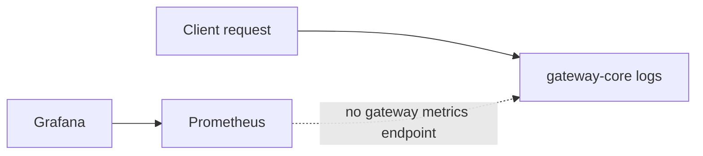

# Observability

> [!summary] At a glance
> Structured request logging exists, while gateway metrics and useful Grafana dashboards remain planned.

## Context

Observability currently combines Fastify/Pino logs with infrastructure
containers for Prometheus and Grafana.

## Components

- Incoming and completed requests are logged with correlation identifiers.
- Completion logs include proxy, endpoint, target, status, and elapsed time.
- Prometheus is configured as infrastructure but the gateway exposes no `/metrics` route.
- Grafana can start, but there is no verified end-to-end gateway dashboard.

## Data Flow

## Failure Modes

Logs remain local to each process and there is no centralized retention.
Prometheus cannot scrape gateway metrics until instrumentation and a metrics
endpoint are implemented.

## Constraints

Do not describe traffic, latency, or error dashboards as operational until a
verified metrics path exists.

## Sources

See [[Global Architecture]], [[Deployment Model]], and [[Current Status]].
