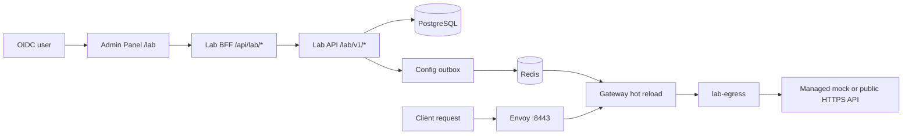

# Personal Gateway Lab

> [!summary] At a glance
> Each OIDC user can provision a 24-hour, logically isolated gateway workspace backed by the real Management API, gateway, policies, PostgreSQL, Redis, PKI, and hot reload.

## Context

The lab provides a safe learning surface without granting access to real
organizations or relying on simplified browser-only gateway simulations. It
reuses the production-shaped runtime while scoping every resource to an
OIDC-owned `LabWorkspace`.

## Components

- **LabWorkspace:** binds `issuer + subject` to one hidden lab organization,
  unique hostname, lifecycle, and expiry.
- **Lab API:** resolves ownership from OIDC and never accepts organization or
  workspace identifiers from the caller.
- **Lab domain services:** reuse proxy revision, deployment, product,
  application, credential, PKI, audit, and outbox rules with lab constraints.
- **Gateway loader:** loads lab deployments under their workspace hostname and
  supplies a workspace-bound copy of `platform-oauth`.
- **Lab egress:** serves declarative mocks and constrained unauthenticated HTTPS
  targets behind internal upstream IDs.
- **Lab portal:** provisions the sample, runs quick authentication checks, and
  exposes advanced resource workflows.
- **Expiry worker:** checks due workspaces every minute; each request also checks
  expiry lazily.

## Data Flow



Runtime isolation is selected by hostname:

```text
https://<workspace-id>.lab.gateway.localhost:8443
```

The gateway resolves only deployments belonging to that workspace plus the
managed OAuth proxy. API keys, OAuth assertions, access tokens, and mTLS
credentials must match the same workspace. Access tokens include
`workspace_id`.

## Failure Modes

- A missing or expired workspace returns `lab_expired` or
  `lab_resource_not_found` without revealing another user's resource.
- More than three creations in 24 hours returns `lab_limit_reached`.
- Revocation or expiry retires routes through the durable outbox; lazy checks
  prevent authorization during convergence.
- A blocked public target returns `lab_upstream_blocked`.
- If Redis notification is lost, periodic gateway reconciliation applies the
  committed outbox version.
- Invalid candidate snapshots preserve the gateway's last valid registry.

## Constraints

- One active workspace per OIDC identity; fixed lifetime of 24 hours.
- Lab deployments use `qual` only and cannot modify global environments,
  standard organizations, platform CAs, or `platform-oauth`.
- Identical base paths are allowed in different workspaces and conflict only
  inside the same workspace.
- Public upstreams allow HTTPS port 443 only and block private, loopback,
  link-local, multicast, metadata, unsafe redirect, and DNS-rebinding targets.
- Mock definitions are declarative and cannot execute JavaScript, templates, or
  filesystem operations.
- Isolation is logical by workspace, not a Compose stack per user.

## Sources

- [[Lab API Reference]]
- [[How to Learn the Gateway with the Lab]]
- [[ADR-009 Logical Lab Workspace Isolation]]
- [[Debug Lab Isolation and Egress]]

