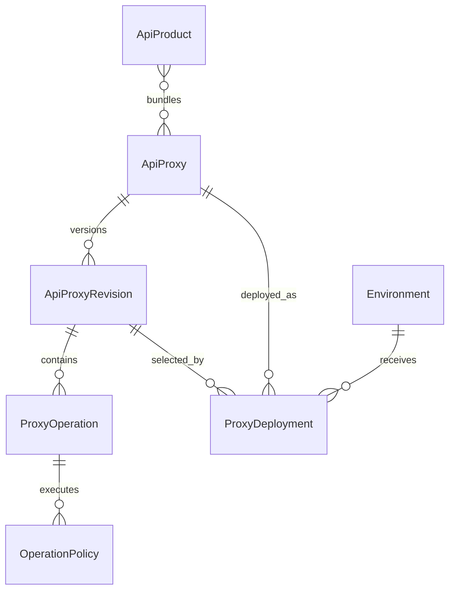
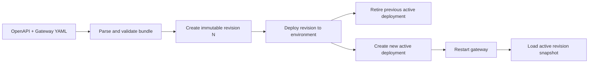

# Proxy Revisions and Deployments

> [!summary] At a glance
> A logical proxy owns immutable configuration revisions; deployments select one revision and one environment-specific upstream while retaining the complete activation and rollback history.

## Context

`ApiProxy` is the stable identity used by products, credentials, OAuth claims,
and organization ownership. Paths, methods, policies, and target mappings can
change independently, so they belong to immutable `ApiProxyRevision` records.

OpenAPI 3.0 or 3.1 defines public operations. A gateway YAML document defines
the public base path, target mapping, and effective policy pipeline. Both files
are validated and committed atomically as one revision.

## Components

- `ApiProxyRevision` stores original and parsed sources, `basePath`, version,
  SHA-256 content hash, and monotonically increasing revision number.
- `ProxyOperation` stores `operationId`, HTTP method, OpenAPI path, mode, and
  target path.
- `OperationPolicy` stores the compiled ordered policy pipeline.
- `ProxyDeployment` points to one revision, environment, upstream, and
  `active | retired` status.

## Data Flow

Revision numbering is serialized by a PostgreSQL advisory lock. Deployment
activation also locks the proxy/environment and environment base-path domains.
The previous deployment is retired and the replacement is created in one
transaction. Deploying an older revision performs a rollback but still creates
a new history record.

Promotion is revision-specific and region-specific. `pprod` requires that the
same revision has existed in `qual`; `prod` requires the same revision in
`pprod`. Retired deployments count as completed promotion evidence.

## Failure Modes

- Invalid OpenAPI, external references, unknown operations, unsupported
  policies, or invalid targets reject the import without creating a revision.
- A forwarding revision without an HTTP(S) upstream is rejected.
- A duplicate active base path in one environment returns
  `deployment_conflict`.
- Missing promotion history returns `promotion_required`.
- The database enforces one active deployment per proxy and environment.
- A committed activation is not visible to a running gateway until restart.

## Constraints

- Revisions have no update or delete Management API.
- OpenAPI `servers` and `security` are informational; gateway YAML controls
  routing and policies.
- OpenAPI schemas are stored but are not request/response validators yet.
- Business imports contain only forward operations and implemented policies.
- Products remain attached to the logical proxy, not an individual revision.
- Hot reload, canary deployment, and multiple active revisions are not part of
  the current model.

## Sources

Use [[Database Schema]] for exact fields, [[API Routes]] for HTTP contracts, and
[[How to Import and Deploy a Proxy Revision]] for the operational workflow.
