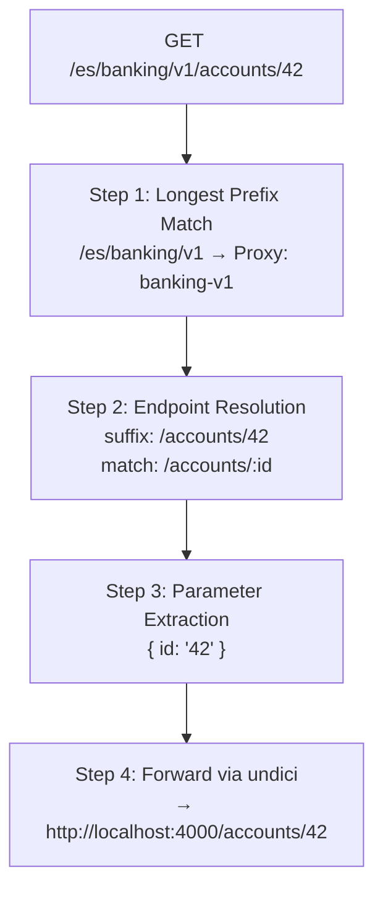

# 🔀 Routing Engine

## Overview

The Routing Engine is the core algorithm inside `gateway-core` that determines how an incoming HTTP request is matched to a specific backend endpoint. It operates in four sequential steps, each narrowing down the match until a target URL is resolved.

---

## Routing Steps

### Step 1: Longest Prefix Match (Proxy Selection)

The gateway maintains a list of configured API proxies, each with a `basePath` (e.g., `/es/banking/v1`). When a request arrives, the engine finds the proxy whose `basePath` is the **longest prefix** that matches the incoming URL.

```
Incoming:  /es/banking/v1/accounts/42

Proxies:
  /es              → ❌ matches, but shorter
  /es/banking      → ❌ matches, but shorter
  /es/banking/v1   → ✅ longest match!
```

> [!IMPORTANT]
> Base paths must be unique across all proxies. Ambiguous matches are not allowed — see [[ADR-001 Longest Prefix Match]].

### Step 2: Endpoint Resolution

Once a proxy is selected, the remaining path suffix is matched against the proxy's configured **endpoints**. Endpoints are auto-sorted using two rules:

1. **Static segments before dynamic** — `/accounts/summary` matches before `/accounts/:id`
2. **Longer paths before shorter** — `/accounts/:id/details` matches before `/accounts/:id`

This ensures the most specific endpoint always wins.

### Step 3: Parameter Extraction

If the matched endpoint contains dynamic segments (prefixed with `:`), the engine extracts their values from the URL:

```
Endpoint pattern:  /accounts/:id
Incoming suffix:   /accounts/42

Extracted: { id: "42" }
```

These parameters are available for policy evaluation and are forwarded to the backend.

### Step 4: Forwarding via undici

The resolved `targetUrl` from the endpoint is combined with the extracted path, and the request is forwarded to the backend service using the `undici` HTTP client.

```
Target URL:  http://localhost:4000
Full path:   http://localhost:4000/accounts/42
Method:      GET (preserved from original request)
```

---

## Example Walkthrough

### Request: `GET /es/banking/v1/accounts/42`



| Step | Input | Output |
| ---- | ----- | ------ |
| 1. Proxy Selection | `/es/banking/v1/accounts/42` | Proxy `banking-v1` (basePath: `/es/banking/v1`) |
| 2. Endpoint Match | `/accounts/42` (suffix) | Endpoint `/accounts/:id` |
| 3. Params | `:id` | `{ id: "42" }` |
| 4. Forward | Target URL + path | `GET http://localhost:4000/accounts/42` |

---

## What Happens When No Match is Found?

- **No proxy matches** → `404 Not Found` with message "No proxy found for path"
- **Proxy matches but no endpoint** → `404 Not Found` with message "No endpoint found"
- **Backend is unreachable** → `502 Bad Gateway`

---

## Related Pages

- [[ADR-001 Longest Prefix Match]]
- [[ADR-002 Explicit Endpoints]]
- [[gateway-core]]
