# Routing Engine

> [!summary] At a glance
> The routing engine resolves the request hostname to one environment, selects the longest active revision prefix, resolves an OpenAPI operation by path and method, and builds its deployment-specific upstream URL.

## Context

Routing is intentionally deterministic and acts as an allowlist. A matching
proxy does not authorize arbitrary backend paths.

## Components

### Proxy Selection

The registry is grouped by `environmentId`. `resolveEnvironment()` maps the
request `Host` authority to the unique `Environment.publicOrigin`; then
`resolveProxy(environmentId, path)` chooses the active deployment revision with
the longest `basePath` that matches either the complete path or a slash
boundary.

```text
Request: /es/banking/v1/accounts/42

/es
/es/banking
/es/banking/v1  <- selected
```

### Operation Selection

The request suffix is matched against explicit operation paths derived from
OpenAPI. Static paths sort before dynamic paths, then longer patterns sort
before shorter ones. Dynamic `{parameters}` match one path segment and are
extracted for forwarding. The HTTP method must also match; a known path with a
different method returns `405 Method Not Allowed` and `Allow`.

### Target Construction

The resolved operation `targetPath` is combined with the deployment
`upstreamBaseUrl`. Dynamic values and incoming query parameters are preserved.

```text
upstreamBaseUrl: http://localhost:4000
targetPath:      /accounts/{id}
parameter:       id=42
final URL:       http://localhost:4000/accounts/42
```

## Data Flow

```mermaid
flowchart LR
    HOST["Request Host"] --> ENV["Environment public origin"]
    ENV --> PATH["Environment registry"]
    PATH --> PROXY["Longest proxy prefix"]
    PROXY --> SUFFIX["Remove base path"]
    SUFFIX --> OPERATION["OpenAPI path and method"]
    OPERATION --> PARAMS["Extract parameters"]
    PARAMS --> TARGET["Build upstream URL"]
```



## Failure Modes

- Unknown environment host: `421 Misdirected Request`.
- No proxy: `404` with `No proxy is configured for path`.
- Proxy but no operation path: `404` with `Endpoint not found in proxy`.
- Operation path but unsupported method: `405` with `Allow`.
- Upstream connection failure: `502 Bad Gateway`.
- Duplicate active base paths inside one environment: startup failure.

## Constraints

Base paths must be unique only among active deployments in the same environment,
so different environments can expose the same URL path. Operation patterns
support named path segments but not wildcards or optional segments. Method
matching is exact.

## Sources

See [[ADR-001 Longest Prefix Match]], [[ADR-002 Explicit Endpoints]],
[[Runtime Request Flow]], [[ADR-007 Hostname-Based Environment Routing]], and
[[Debug Gateway 404]].
