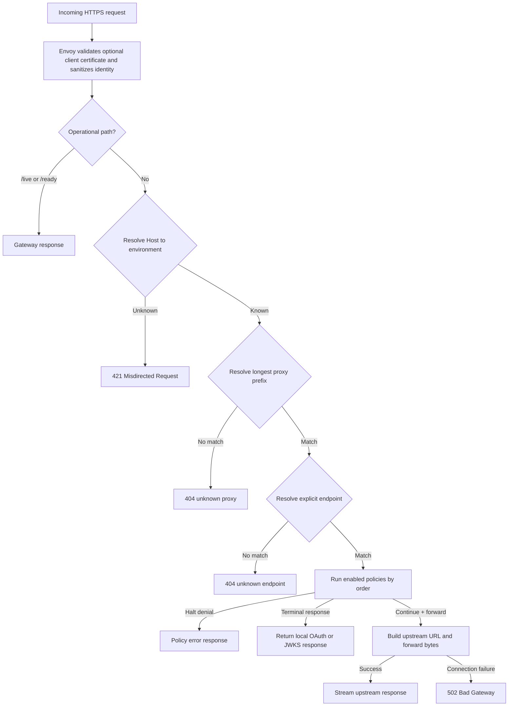

# Runtime Request Flow

> [!summary] At a glance
> Every non-operational request passes through hostname-based environment selection, proxy resolution, endpoint resolution, and the ordered policy pipeline; forwarding occurs only when a non-terminal forward endpoint continues.

## Context

The gateway keeps routing configuration in memory so request processing does not
query PostgreSQL for every request.

## Components

## Data Flow

Dynamic route parameters are extracted from the public endpoint path and
substituted into `targetPath`. Query parameters and arbitrary body bytes are
preserved. Hop-by-hop headers are removed from both directions.
The environment comes from the request authority matched against
`Environment.publicOrigin`; no request header or default environment can
override it.

## Failure Modes

Policy dependency failures are handled according to `failureMode`. Business
denials such as invalid credentials or exceeded limits halt normally and are not
treated as infrastructure degradation.

API key and mTLS authorization query PostgreSQL. OAuth token issuance queries
PostgreSQL and JWT Bearer additionally requires Redis replay protection.
Gateway-issued Bearer verification is stateless and does not query PostgreSQL.
For mTLS, Envoy rejects invalid chains and CRLs before the request reaches the
gateway; `mtls-auth` then authorizes the connection-derived fingerprint.

## Constraints

The gateway routing registry changes only at startup. Envoy certificate and CRL
trust is a separate runtime and reloads atomically through file SDS.

## Sources

See [[Routing Engine]], [[gateway-core]], and [[Debug Gateway 404]].
