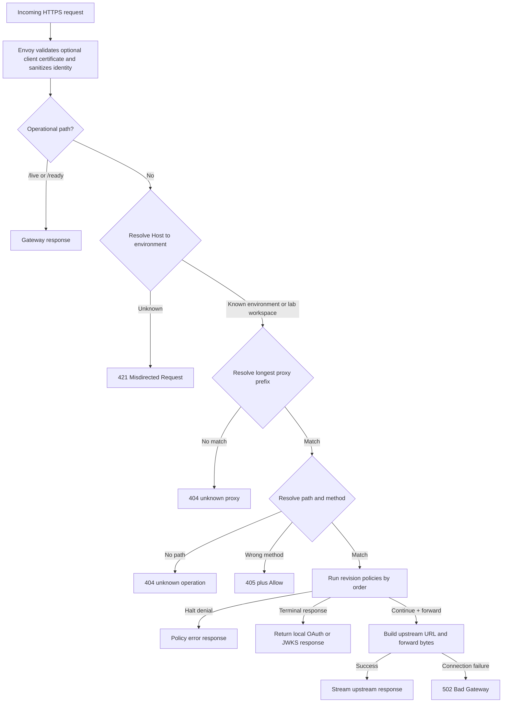

# Runtime Request Flow

> [!summary] At a glance
> Every non-operational request passes through hostname environment selection, active-revision proxy resolution, method-aware operation resolution, and the ordered policy pipeline.

## Context

The gateway keeps routing configuration in memory so request processing does not
query PostgreSQL for every request.

## Components

## Data Flow

Dynamic `{parameter}` values are extracted from the OpenAPI operation path and
substituted into `targetPath`. Query parameters and arbitrary body bytes are
preserved. Hop-by-hop headers are removed from both directions.
The environment comes from the request authority matched against
`Environment.publicOrigin`; no request header or default environment can
override it.

For `*.lab.gateway.*`, the authority resolves both the workspace and the qual
environment used by its deployment. The registry contains only that workspace's
active deployments plus its workspace-scoped managed OAuth proxy. Identical
base paths in another lab therefore occupy a different resolver scope.

## Failure Modes

Policy dependency failures are handled according to `failureMode`. Business
denials such as invalid credentials or exceeded limits halt normally and are not
treated as infrastructure degradation.

API key and mTLS authorization query PostgreSQL. OAuth token issuance queries
PostgreSQL and JWT Bearer additionally requires Redis replay protection.
Gateway-issued Bearer verification is stateless and does not query PostgreSQL.
For mTLS, Envoy rejects invalid chains and CRLs before the request reaches the
gateway; `mtls-auth` then authorizes the connection-derived fingerprint.
All four authentication flows additionally enforce workspace equality when the
resolved route is a personal lab.

## Constraints

The gateway loads only `active` deployments and their selected immutable
revision. Routing mutations return `runtimeRefreshRequired: false` plus a queued
outbox version. Redis notification or periodic PostgreSQL reconciliation loads
a complete candidate snapshot and replaces the registry atomically. Envoy
certificate and CRL trust is a separate runtime and reloads through file SDS.

## Sources

See [[Routing Engine]], [[gateway-core]], [[Personal Gateway Lab]], and
[[Debug Gateway 404]].
