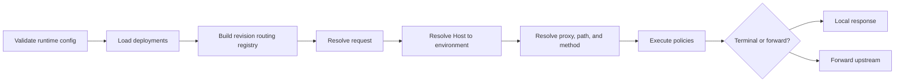

# gateway-core

> [!summary] At a glance
> `gateway-core` is the data-plane process that loads a configuration snapshot, resolves requests, executes policies, and forwards allowed traffic.

## Responsibility

The package owns request-time behavior. It does not create or modify gateway
configuration.

## Boundaries

- Reads active deployments and their exact revisions once during startup.
- Keeps all active deployments in an environment-grouped in-memory registry.
- Connects to Redis lazily when a Redis-backed policy executes.
- Imports the gateway signing key and trusted ingress CIDRs at startup.
- Trusts only Envoy's connection-derived certificate fingerprint from the
  configured immediate-source CIDR.
- Communicates with upstream services through `undici`.
- Does not expose management CRUD or configuration reload endpoints.

## Public Contracts

`buildServer()` returns a configured Fastify instance without listening, which
allows deterministic injection tests. `loadEnv()` validates runtime
configuration. The resolver exports registry and resolution functions used by
the server and tests.

## Runtime Flow



Unknown business hosts return `421`; there is no default environment. Within
the selected environment, proxy matching uses the longest boundary-safe
`basePath` from the active revision. Operation matching is exact by method and
path, supports OpenAPI `{name}` parameters, allows a trailing slash, and
prioritizes static routes before dynamic routes. A known path with a different
method returns `405` and an `Allow` header.

The forwarding layer preserves query parameters and arbitrary body bytes,
removes hop-by-hop headers, adds forwarding and correlation headers, and returns
`502` when the upstream connection fails.

## Configuration

See [[Environment Variables]]. Cryptographic configuration is required in
development and production. Environment loading defaults to all deployments
and can be restricted with an optional allowlist.

## Tests

The package covers environment validation, routing, operational endpoints,
byte-preserving forwarding, method-aware operation routing, OpenAPI target
parameter substitution, policy ordering, API key authorization, OAuth
issuance and cross-environment rejection, assertion replay, mTLS trust
boundaries, local responses, Redis failure modes, and environment-isolated
rate-limit behavior.

Run:

```bash
npm test --workspace=packages/gateway-core
```

## Limitations

- Configuration reload requires a process restart.
- Metrics are not exposed.
- Forwarding timeouts are fixed at 30 seconds.

## Related Notes

- [[Runtime Request Flow]]
- [[Routing Engine]]
- [[Policy Types]]
- [[Debug Gateway 404]]
- [[Debug Policy Failure]]
- [[Authentication and Authorization]]
- [[Proxy Revisions and Deployments]]
