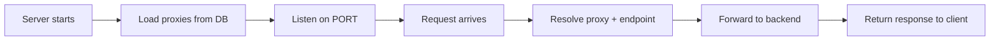

# 📦 gateway-core

## Responsibility

`gateway-core` is the **Data Plane** of the API Gateway Platform. It is the runtime component that:

1. **Receives** all incoming API traffic on port `3000`
2. **Resolves** which proxy and endpoint match the request
3. **Forwards** the request to the appropriate backend service

> [!IMPORTANT]
> `gateway-core` does **NOT** manage configuration or write to the database. It only **reads** proxy configurations at startup (and on hot-reload events).

---

## Key Files

| File | Purpose |
| ---- | ------- |
| `src/server.ts` | Fastify server setup, route registration, startup |
| `src/proxy/resolver.ts` | Routing engine — longest prefix match, endpoint resolution |
| `src/proxy/forwarder.ts` | HTTP forwarding via `undici` to backend services |
| `src/db/proxy-loader.ts` | Loads proxy configurations from the database at startup |
| `src/config/env.ts` | Environment variable parsing and validation (Zod) |
| `src/index.ts` | Entry point |

---

## Dependencies

| Package | Type | Purpose |
| ------- | ---- | ------- |
| `@api-gateway/shared` | Internal | Shared TypeScript types |
| `@api-gateway/database` | Internal | Prisma client for reading config |
| `fastify` | External | HTTP server framework |
| `undici` | External | HTTP client for forwarding requests |
| `zod` | External | Environment variable validation |

---

## Scripts

| Script | Command | Purpose |
| ------ | ------- | ------- |
| `dev` | `npx tsx watch src/index.ts` | Start in dev mode with hot-reload |
| `build` | `tsc` | Compile TypeScript to JavaScript |
| `test` | `vitest` | Run test suite |

---

## Environment Variables

| Variable | Default | Description |
| -------- | ------- | ----------- |
| `PORT` | `3000` | Port the gateway listens on |
| `DATABASE_URL` | — | PostgreSQL connection string |
| `LOG_LEVEL` | `info` | Fastify log level |

---

## How It Works

At startup, `gateway-core`:
1. Parses environment variables
2. Loads all active proxy configurations from PostgreSQL
3. Builds a routing table in memory
4. Starts the Fastify server

For each request:
1. The resolver finds the matching proxy (longest prefix match)
2. The resolver finds the matching endpoint (static before dynamic)
3. The forwarder sends the request to the backend via `undici`
4. The backend response is returned to the client

---

## Related Pages

- [[Routing Engine]]
- [[Database and Prisma]]
- [[shared]]
- [[database]]
