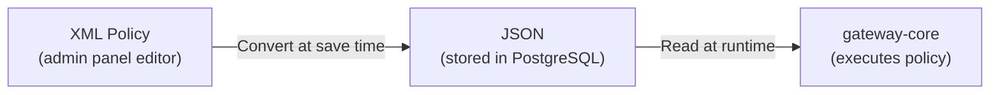

# ADR-004: XML Policies

| Field | Value |
| ----- | ----- |
| **Status** | ✅ Accepted |
| **Date** | 2026-07-06 |
| **Category** | Policy Engine |

---

## Context

Apigee — the enterprise API management platform this project draws inspiration from — uses **XML** to define policies (rate limiting, authentication, CORS, etc.). A key design question is how this gateway should handle policy configuration.

The challenge is to balance:
- **Apigee compatibility** — Familiar format for teams migrating from Apigee
- **Runtime performance** — Policies are evaluated on every request
- **Developer experience** — Easy to create, edit, and validate policies

---

## Decision

Support XML as the **configuration format** for policies, but store and execute them as **JSON** internally.

### Architecture



| Layer | Format | Purpose |
| ----- | ------ | ------- |
| **Admin Panel** | XML | User-facing editor with XML syntax |
| **Save/Validation** | XML → JSON | Converted and validated when saving |
| **Database** | JSON | Stored in `EndpointPolicy.configuration` column |
| **Runtime** | JSON | gateway-core reads JSON, no XML parsing at request time |

### Example

**What the admin sees (XML):**
```xml
<RateLimit>
  <Quota>100</Quota>
  <Interval>1</Interval>
  <TimeUnit>minute</TimeUnit>
</RateLimit>
```

**What the database stores (JSON):**
```json
{
  "quota": 100,
  "interval": 1,
  "timeUnit": "minute"
}
```

**What the gateway reads:**
The JSON object — no XML parsing on the hot path.

---

## Alternatives Considered

### JSON Only

Use JSON for both configuration and storage.

❌ **Rejected** — Loses Apigee compatibility. Teams familiar with Apigee expect XML-based policy configuration. JSON is less readable for complex nested policies.

### YAML

Use YAML as the configuration format.

❌ **Rejected** — Not Apigee-like. While more readable than JSON, it doesn't provide the Apigee compatibility benefit that XML offers.

### Execute XML Directly

Parse and evaluate XML at runtime for every request.

❌ **Rejected** — Too slow. XML parsing is significantly more expensive than JSON object access. On a hot path that runs for every API request, this overhead is unacceptable.

---

## Consequences

### ✅ Positive

- **Apigee compatibility** — Familiar format for teams migrating from or working alongside Apigee
- **Zero runtime overhead** — No XML parsing on the request hot path
- **Validation at config time** — XML is validated and converted when saving, not at runtime
- **Flexible storage** — JSON in PostgreSQL is queryable and indexable

### ⚠️ Constraints

- **XML-to-JSON converter needed** — Each policy type requires a conversion function
- **Admin panel XML editor** — The admin panel must include an XML editor component
- **Dual format complexity** — Developers must understand both the XML input format and the JSON storage format

---

## Related Pages

- [[Policies in Apigee]]
- [[Request Lifecycle in Apigee]]
