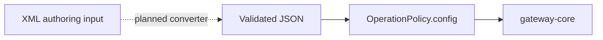

# ADR-004: XML Policies

> [!summary] At a glance
> XML compatibility remains an accepted target decision, while the current runtime stores and validates JSON policy configuration.

## Context

Apigee represents policies as XML. The project wants a migration path familiar
to Apigee users without parsing XML on the request hot path.

Current implementation is JSON/YAML-only: Gateway YAML is normalized into the
Prisma JSON field `OperationPolicy.config`, and shared Zod schemas validate it
during immutable revision import.

## Decision

Accept XML as a future control-plane input format, convert and validate it when
configuration is saved, and continue storing and executing normalized JSON.

The dashed conversion step is not implemented.

## Alternatives

- JSON only: simplest and matches current code, but does not provide an Apigee-oriented authoring experience.
- YAML input: readable but does not improve Apigee compatibility.
- Runtime XML parsing: rejected because request-time parsing adds avoidable work and failure modes.

## Consequences

- Each supported XML policy will need a versioned parser and semantic validator.
- The Admin Panel will need an XML-capable editor only when this authoring path is implemented.
- JSON remains the canonical persistence and runtime format.
- Documentation must not show XML examples as currently accepted Management API payloads.

## Related Implementation

- [[Policies in Apigee]]
- [[Policy Types]]
- [[Management API]]
